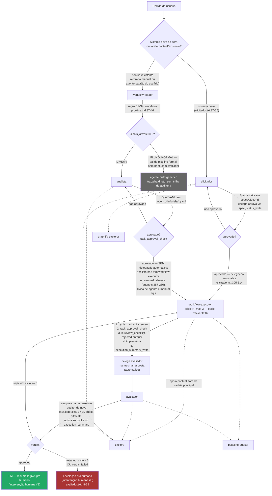

# Arquitetura de agentes do XOCP

Este documento descreve os agentes **realmente registrados** em
`packages/opencode/src/agent/agent.ts` (a fonte de verdade em runtime) e o
fluxo ponta a ponta que eles formam. Toda afirmação de "isso existe" ou
"isso está conectado" abaixo cita arquivo e linha — quando um mecanismo
existe no código mas não é alcançado por nenhum caminho real de execução,
isso é dito explicitamente na seção 5 (Limitações conhecidas), não
omitido.

## 0. Nota — `AGENTS.md` §1 descreve um sistema diferente deste

`AGENTS.md` linhas 3–20 ("System Agent Directory — 14 Cognitive Agents")
lista nomes como **Cluster Dispatcher**, **core Lead**, **backend Lead**,
**frontend Lead**, **Auditor**, **Graphify Operator**, **Research
Operator**, **Evolution Incident Reporter** e **Session Compactor**.
Nenhum desses é um agente registrado em `agent.ts` — são nomes do
subsistema "Cluster Dispatcher" aspiracional (ver §5.1 abaixo) ou
sinônimos informais para agentes que existem com outro nome (`baseline-auditor`,
`graphify-explorer`, `compaction`). O número "14" bate por coincidência —
são dois conjuntos de 14 diferentes. **Este documento, não `AGENTS.md`
§1, reflete o que roda de verdade.** `AGENTS.md` §3 ("Executor Pre-Flight
Self-Test Protocol", linhas 41–50) descreve `runExecutorSelfTest` como um
gate obrigatório do fluxo real — isso passou a ser verdade a partir da
Tarefa 8 (`specs/xocp/prompt-implementacao-melhorias-xocp-v2.md`); ver
§5.3 para os detalhes de conexão e a nota histórica.

## 1. Os 15 agentes nativos

Fonte: `packages/opencode/src/agent/agent.ts`, objeto `agents`. A coluna
**Model tier** é uma recomendação deste documento, não algo configurado
no código — nenhum dos 15 agentes fixa um `model` em `agent.ts` (o campo
`model` existe no schema, linha 53–58, mas não é usado em nenhuma das 15
entradas); todos herdam o modelo padrão da sessão ou o override do
usuário em `opencode.json`.

**Nota (Tarefa 10):** o 15º agente é `pattern-auditor`
(`agent.ts:418-438`), somado aos 14 originais documentados abaixo — ver
linha da tabela e §1.2.

| Agente | Modo | Pipeline? | Model tier (recomendado) | O que faz | Resumo do prompt real |
|---|---|---|---|---|---|
| `build` | primary | Não | Depende da tarefa (padrão do usuário) | Agente genérico padrão, executa qualquer tool conforme permissão configurada. Sem prompt customizado (`agent.ts:149-164`, sem campo `prompt`). | — (usa o system prompt genérico do OpenCode, não um `.txt` do pipeline XOCP) |
| `plan` | primary | Não | Depende da tarefa | Modo somente-leitura/planejamento — `edit`/`write`/`apply_patch` bloqueados por padrão, só `.opencode/plans/*.md` liberado (`agent.ts:165-191`). | — (idem, sem prompt customizado) |
| `elicitador` | primary | **Sim** | Tier alto (ambiguidade, julgamento, conversas longas) | Conduz elicitação de requisitos do zero e gera Spec completa em `specs/<slug>.md`. Nunca implementa nem edita código fora de `specs/*.md`. | 3 fases: (1) triagem inicial decide se é elicitação nova, incremento ou fluxo pontual (`elicitador.txt:25-59`); (2) conduz a conversa por rascunho-e-confirmação, não formulário (`:63-104`); (3) baseline interno de 6 regras técnicas travadas + stack recomendada + checagem de frescor via busca (`:191-282`). Regra dura: sempre entrega uma Spec, nunca recomenda não construir (`:139-162`); Spec só existe se gravada em arquivo (`:164-187`). |
| `workflow-triador` | primary | **Sim** | Tier baixo (classificação mecânica, sem geração de conteúdo) | Classifica a tarefa como `DIVIDIR` ou `FLUXO_NORMAL` pela régua de 4 sinais S1–S4. Read-only puro — nunca escreve Brief nem implementa. | Avalia S1 (≥3 superfícies de deploy), S2 (≥3 critérios independentes de natureza distinta), S3 (≥8 arquivos em ≥2 dirs não-adjacentes), S4 (≥2 fases sequenciais); ≥2 sinais ativos → `DIVIDIR` (`workflow-triador.txt:23-32`). Saída é só um bloco YAML de triagem, nada mais (`:34-47`). |
| `analista` | primary | **Sim** | Tier alto (investigação + especificação verificável) | Investiga o repositório e escreve Briefs YAML em `.opencode/briefs/<brief_id>.yaml`. Nunca implementa. | Fluxo obrigatório antes de escrever: confirmar o que já existe na branch remota, mapear arquivos reais via busca, checar padrão duplicado, cortar escopo por domínio, definir comando de verificação exato (`analista.txt:17-34`). Nunca edita brief in-place — incrementa `version` + `history` (`:73-84`); limite de 2 rodadas de esclarecimento antes de escalar (`:86-88`). |
| `workflow-executor` | primary | **Sim** | Tier alto (implementação de código real) | Implementa Briefs/Specs já aprovados, com trilha de auditoria (`cycle_tracker`, `self_test_tracker`, `execution_summary_write`). | Sequência fixa por ciclo: `cycle_tracker.increment` → `task_approval_check` → ler `review_checklist_read` do ciclo anterior se `rejected` → implementar → loop de autoteste obrigatório via `self_test_tracker` (contador isolado do `cycle_tracker`, máx. 3 tentativas, escalação separada se estourar — Tarefa 8) → opcionalmente `baseline-auditor` → `execution_summary_write` → delegar `avaliador` na mesma resposta (`workflow-executor.txt:7-100`, numeração após a regra de primeiro passo e o passo de autoteste adicionados nesta e na revisão anterior). Nunca chama `edit`/`write`/`apply_patch`/bash mutável antes do `task_approval_check` passar (`:105-106`). |
| `avaliador` | primary | **Sim** | Tier alto (julgamento independente, adversarial) | Revisa a entrega do executor de forma independente — nunca aceita o autorrelato sem verificação própria — e grava `review_checklist`. Read-only no código. | Lê `execution_summary_read`, mas isso nunca basta sozinho — sempre roda teste/lê diff/confere critério por critério (`avaliador.txt:5-13`); item `completed` com `external_source` nunca conta como verificado internamente (`:15-22`); sempre chama `baseline-auditor` de novo, mesmo que o executor já tenha rodado (`:31-42`); `rejected` volta pro executor se ciclo ≤3, `failed` sempre escala direto pro humano mesmo com ciclo livre (`:44-69`). |
| `general` | subagent | Não | Tier médio | Propósito geral, pesquisa/execução multi-step em paralelo. Sem prompt customizado (`agent.ts:332-345`). | — |
| `explore` | subagent | Não | Tier baixo/rápido (busca, não geração) | Busca rápida em código por padrão/keyword/pergunta estrutural, com 3 níveis de profundidade declarados por quem chama. | Especialista em glob/grep/read; nunca cria arquivo nem roda bash mutável (`explore.txt:1-18`). |
| `graphify-explorer` | subagent | Não | Tier baixo/rápido | Perguntas estruturais de código (chamadas, imports, herança, caminhos de dependência) via `graphify_query`. | Sempre usa `graphify_query` para pergunta estrutural, nunca adivinha por nome de arquivo (`graphify-explorer.txt:1-17`). |
| `baseline-auditor` | subagent | Não | Tier médio (mistura mecânico + julgamento) | Audita as 11 regras fixas do Baseline Global (`specs/xocp/baseline-global.md`) contra o código. Read-only, nunca edita. | 6 regras de segurança majoritariamente mecânicas (grep por padrão) + 5 regras de UI/UX que misturam mecânico e julgamento; marca `not_applicable` explicitamente quando não se aplica, nunca omite da lista (`baseline-auditor.txt:9-59`). |
| `pattern-auditor` | subagent | Não (apoio ao pipeline, chamado pelo `avaliador`) | Tier médio (síntese de dados + julgamento de "isso é candidato a regra nova?") | Relata recorrência de padrões no pipeline — mesmo perfil read-only de `baseline-auditor` (`agent.ts:420-431`: `"*": "deny"` + `grep`/`glob`/`read`/`pattern_recurrence_read`/`external_directory` liberados). Nunca implementa, nunca edita, nunca abre delegação própria de correção. | Chama `pattern_recurrence_read` (sem parâmetros, relatório do projeto inteiro) e separa SEMPRE em duas categorias, nunca misturadas: "erro recorrente" (mesmo critério/regra reprovando em ≥3 tarefas distintas — candidato a regra nova ou ajuste de prompt, mas só sugere) e "rotina recorrente" (candidato a tool/skill nova; nesta versão vem vazia com limitação documentada, nunca preenchida por heurística forçada) (`pattern-auditor.txt:14-41`). Princípio citado explicitamente do próprio prompt: "o sistema aprende via spec mais afiada, não via modelo mudando sozinho" (`pattern-auditor.txt:4-7`, ecoando `workflow-pipeline-v2.md` §8). |
| `compaction` | primary, oculto | Não | Tier baixo/rápido (alto volume, tarefa mecânica) | Interno — resume conversa longa num formato estruturado pra outro agente continuar. | Segue exatamente a estrutura pedida, nunca continua a conversa nem responde perguntas (`compaction.txt:1-5`). |
| `title` | primary, oculto | Não | Tier baixo/rápido | Interno — gera título de sessão (≤50 caracteres, uma linha). | Regras rígidas de formato + exemplos; nunca usa tools (`title.txt:1-44`). |
| `summary` | primary, oculto | Não | Tier baixo/rápido | Interno — gera resumo de sessão em 2-3 frases, estilo descrição de PR. | Primeira pessoa, não menciona testes/builds, preserva pergunta pendente se houver (`summary.txt:1-11`). |

### 1.1 `task` (delegação) — o que cada um pode chamar, e uma ressalva técnica sobre a coluna abaixo

| Agente | Pode delegar (`task`) para — intenção declarada em `agent.ts` |
|---|---|
| `elicitador` | `explore`, `graphify-explorer`, `workflow-executor` (nega `general`) — `agent.ts:203-208` |
| `workflow-triador` | nenhum — permissão é `"*": "deny"` com só `grep/glob/list/bash/webfetch/websearch/read` liberados; `task` nunca é liberado (`agent.ts:229-239`) |
| `analista` | `explore`, `workflow-executor` (nega `general`) — `agent.ts:258-262`. O `workflow-executor` foi adicionado na Tarefa 11 (ver §1.2) especificamente para disparo paralelo de sub-Briefs prontos, não para o caminho sequencial normal (que segue manual — ver observação 2 da seção 2). |
| `workflow-executor` | `explore`, `avaliador`, `baseline-auditor` — `agent.ts:285-289` |
| `avaliador` | `explore`, `workflow-executor`, `baseline-auditor`, `pattern-auditor` (nega `general`) — `agent.ts:319-325`. O `pattern-auditor` foi adicionado na Tarefa 10, condicionado ao marcador `<recurrence_report_trigger>` no output de `review_checklist_write` (ver §1.2). |

**Ressalva verificada, não no pedido original mas relevante para não
enganar quem for editar `agent.ts`:** a avaliação de permissão
(`packages/opencode/src/permission/index.ts:28-38`, função `evaluate`)
usa `findLast` sobre o ruleset mesclado — o último rule que casar
`permission` + `pattern` (via wildcard) vence. O bloco de `defaults`
(`agent.ts:127-144`) define `"*": "allow"` global. Isso tem uma
consequência real: `elicitador`, `analista` e `workflow-executor` **não**
definem um `"*": "deny"` próprio — então, tecnicamente, um `task` para um
agente que não está na lista acima (ex.: `elicitador` chamando
`avaliador` diretamente) **não é bloqueado pela permissão**, cai no
`"*": "allow"` dos defaults. Só o padrão `general` é explicitamente
negado nesses três. Já `workflow-triador` e `avaliador` definem
`"*": "deny"` como primeira regra do seu bloco (`agent.ts:230` e
`agent.ts:306`), então **para esses dois, só os padrões explicitamente
listados como `allow` são alcançáveis** — um `task` pra um nome fora da
lista é de fato negado. Na prática isso não importa porque nenhum prompt
instrui esses agentes a chamar algo fora da lista documentada acima — mas
é uma diferença real de enforcement entre os dois grupos, não um detalhe
cosmético.

### 1.2 Três mecanismos novos (Tarefas 9, 10, 11)

**Tarefa 9 — diário de bordo do Executor.** Arquivo por tarefa,
`.opencode/execution-log/<task_id>.md`, texto livre técnico (não JSON),
append-only, uma seção por ciclo (`## Ciclo N / O que fiz / Por que
escolhi essa abordagem / O que ficou em dúvida`). Escrito pelo
`workflow-executor` no mesmo turno de `execution_summary_write`
(`workflow-executor.txt:110-120`) e lido por ele mesmo no início do
próximo ciclo, ANTES de reagir ao veredito do Avaliador
(`workflow-executor.txt:25-36`, novo passo 3, antes do passo 4 de leitura
do `review_checklist_read`) — memória de raciocínio próprio, não um
checklist estruturado. Gitignored com o mesmo padrão de
`.opencode/briefs/.gitignore` (`*` + `!.gitignore`, verificado antes de
criar — não assumido por convenção). Nunca lido pelo Avaliador ou pelo
humano por padrão; sem shielding de permissão como o autoteste da
Tarefa 8 porque não há requisito de sigilo aqui, só de não poluir os
outros fluxos (nenhuma tool nova foi criada — `edit`/`write` já bastam).

**Tarefa 10 — registro de recorrência / auto-evolução.** Três fontes de
evento fixas, gravadas via `recordPatternEvent`
(`packages/core/src/evolution/pattern-events.ts:52-60`, tabela
`pattern_events` em `.opencode/pattern-events.db`, padrão `bun:sqlite`
idêntico a `cycle-tracker.ts`/`self-test-tracker.ts` — banco próprio,
nunca reaproveita as tabelas desses dois):
1. `review_checklist_write` grava um evento por critério reprovado
   (`packages/opencode/src/tool/review-checklist-write.ts:47`).
2. `baseline-audit-write` grava um evento por item reprovado
   (`packages/opencode/src/tool/baseline-audit-write.ts:35`).
3. `self_test_tracker` grava um evento (`category_id:
   "self_test_exhausted"`) quando o autoteste da Tarefa 8 esgota as 3
   tentativas (`packages/opencode/src/tool/self-test-tracker.ts:49`).

Alerta de "erro recorrente": mesmo `category_id`+`source` reprovando em
≥3 **tarefas distintas** (não ciclos de retentativa dentro da mesma
tarefa — isso já é o que `cycle_tracker` cobre) dentro de uma janela de
20 tarefas concluídas OU 30 dias, o que vier primeiro
(`pattern-events.ts:12-14,95-107,118-144`). Contador cumulativo de
tarefas concluídas: não existia nenhum antes desta tarefa (verificado —
o único candidato era o contador em memória, por-execução, nunca
persistido de `ClusterDispatcher`, `cluster/dispatcher.ts:67`, inútil
entre sessões); criado do zero como tabela `task_completions`
(`pattern-events.ts:42-46,68-81`), incrementado por
`recordTaskCompletion` a cada `verdict: "approved"` em
`review_checklist_write` (`review-checklist-write.ts:57`). A cada
múltiplo de 10, o output da tool inclui um bloco
`<recurrence_report_trigger>` (`review-checklist-write.ts:60-61`), que
`avaliador.txt:75-81` (passo 9, novo) instrui a virar delegação via
`task` pro `pattern-auditor` na mesma resposta — automático, sem esperar
pedido do humano.

O relatório (`pattern_recurrence_read`,
`packages/opencode/src/tool/pattern-recurrence-read.ts`) sempre separa
duas categorias, nunca mistura: "erro recorrente" (populada, com
`category_id`, contagem de tarefas distintas e sugestão textual — nunca
implementa a correção) e "rotina recorrente" (deliberadamente vazia
nesta primeira versão, com uma limitação documentada em vez de heurística
forçada — `pattern-events.ts:156-165,171-175`: nada no código hoje
registra o que o Executor efetivamente tocou por Brief de forma
comparável entre tarefas não relacionadas, `files_expected_touched` é só
a estimativa do Analista). O agente `pattern-auditor` (subagent, mesmo
perfil read-only de `baseline-auditor`, ver tabela da seção 1) nunca
implementa a melhoria sozinho — só relata, mesmo princípio de
`workflow-pipeline-v2.md` §8 já citado no próprio prompt
(`pattern-auditor.txt:4-7,43-46`).

**Tarefa 11 — paralelismo real entre Briefs independentes.** Decisão de
arquitetura resolvida por investigação, não suposição: existe uma classe
pronta pra orquestrar DAG de Briefs, `ClusterDispatcher`
(`packages/core/src/cluster/dispatcher.ts:20`, já documentada como
subsistema sem caller em §5.1), mas ela opera sobre `TechnicalBriefV2`
(`files_scope`/`contracts`/`verification_gates`), um schema diferente do
Brief real (`files_expected_touched`/`constraints`/`acceptance_criteria`,
seção 4 de `workflow-pipeline.md`). Confirmado também que
`ctx.extra.promptOps` — o mecanismo que permitiria uma tool comum
disparar `task` internamente — é populado genericamente pra qualquer
tool em `packages/opencode/src/session/tools.ts:64`, não só pra
`task.ts` (`packages/opencode/src/tool/task.ts:197-198`); ou seja, a
Rota 1 (tool nova que usa o `executor` do `ClusterDispatcher`
internamente) era tecnicamente viável. Optou-se pela Rota 2 mesmo assim,
por dois motivos combinados: o desalinhamento de schema já citado (forçar
o Brief real no formato `TechnicalBriefV2` só pra usar a classe seria
duplicação de schema, contra a regra do próprio `analista.txt:25-28`) e a
existência de um precedente já documentado no projeto pro mesmo padrão —
bash paralelo em `packages/opencode/src/tool/shell/prompt.ts:108,159,208`
("se os comandos são independentes... múltiplas chamadas numa única
mensagem"). `ClusterDispatcher` fica como está — referência de design e
teste de unidade da lógica de DAG (`packages/core/test/cluster/dispatcher.test.ts`,
inalterado por esta tarefa, 2/2 passando), não peça viva do fluxo.

Regra de divisão nova em `analista.txt:69-102` (passo 6): candidato a N
sub-Briefs quando ≥2 conjuntos de `files_expected_touched` não se
sobrepõem E não há razão de espera entre eles (teste prático: "consigo
mockar a ponta que falta pra este pedaço existir sozinho?"); teto de 4
sub-Briefs por tarefa original; não divide se o pedaço resultante tocaria
menos de 1 arquivo relevante ou um único critério trivial. Sub-Briefs sem
dependência entre si são delegados via múltiplas chamadas `task` pro
`workflow-executor` na mesma resposta do Analista — por isso
`"workflow-executor": "allow"` foi somado ao `task` allow-list do
`analista` (`agent.ts:261`, tabela da seção 1.1). Isso fecha parcialmente
o gap descrito na observação 2 da seção 2 e no achado 5.4: continua não
existindo delegação automática no caminho sequencial normal
Analista→Executor (a troca de agente ainda é manual pra um Brief único
aprovado), mas para o caso específico de sub-Briefs paralelos e
independentes, a automação agora existe e está testada
(`packages/opencode/test/agent/agent.test.ts`, "Tarefa 11: analista can
delegate to workflow-executor via task (parallel sub-Brief dispatch)").

## 2. Fluxo ponta a ponta

Dois pontos de entrada convergem no mesmo ciclo executor↔avaliador.
Citações: `specs/xocp/workflow-pipeline.md:44-46` (FLUXO_NORMAL sai do
pipeline), `specs/xocp/workflow-pipeline-v2.md:396-421` (ciclo),
`elicitador.txt:305-314` (delegação automática do elicitador),
`workflow-executor.txt` (delegação automática pro avaliador),
`avaliador.txt:44-69` (decisão de reprovar/escalar).



**Duas observações do diagrama que não estavam no pedido original, mas
são necessárias pra ele não mentir:**

1. **`FLUXO_NORMAL` sai do pipeline inteiramente** — não é "o mesmo
   fluxo sem dividir em ramos", é literalmente "agente único, sem brief,
   sem avaliador" (`specs/xocp/workflow-pipeline.md:44-46`, regra de
   decisão explícita). Só `DIVIDIR` entra no pipeline completo
   (Analista → Brief → workflow-executor → Avaliador).
2. **O caminho `workflow-triador` → `analista` → `workflow-executor` não
   tem delegação automática pro caso sequencial normal** — diferente do
   caminho `elicitador` → `workflow-executor`, que É automático
   (`elicitador.txt:305-314`, confirmado pela permissão `task: {
   workflow-executor: allow }` em `agent.ts:207`). `workflow-triador` não
   tem permissão `task` alguma (`agent.ts:229-239`). **Parcialmente
   fechado na Tarefa 11** para o caso específico de sub-Briefs paralelos
   e independentes: `analista` agora tem `workflow-executor` no seu
   `task` allow-list (`agent.ts:258-262`) e `analista.txt:69-102` (passo
   6) instrui a delegar via `task`, uma chamada por sub-Brief pronto, na
   mesma resposta — mas só quando o Brief foi dividido em sub-Briefs sem
   dependência entre si (regra de divisão da Tarefa 11, ver §1.2). Para
   um Brief único, não dividido, continua sem instrução de
   auto-delegação em `analista.txt` — comparar com a instrução explícita
   equivalente em `elicitador.txt:305-314`, que segue sem par pra esse
   caso. Isso é uma extensão natural da limitação #4 da seção 5 (não
   existe orquestrador determinístico) — pro Brief único o gap
   permanece: não é "o agente pode ignorar a instrução", é "a instrução
   de auto-delegação simplesmente não existe pra esse caso no prompt
   atual". Depois de um Brief único aprovado, o `workflow-executor`
   ainda precisa ser acionado manualmente (seleção de agente pelo
   usuário, ou outro mecanismo fora do que os prompts descrevem hoje).

## 3. Os 3 únicos pontos de intervenção humana no fluxo automático

Fonte: `specs/xocp/workflow-pipeline-v2.md:434-443` (seção 6.1).

1. **Aprovar a Spec/Brief** — confirmação real via `ask` na ferramenta
   `spec_status_write` (mesma ferramenta serve Brief e Spec).
2. **Ler o resumo final** quando o Avaliador aprova — não exige ação,
   só leitura.
3. **Responder a uma escalação** — limite de ciclo atingido (>3,
   `cycle-tracker.ts:8,112`) ou `verdict: "failed"` (critério do
   Brief/Spec incoerente, não é erro de código de implementação —
   `avaliador.txt:57-69`).

Tudo o mais — troca de agente, leitura de checklist anterior,
delegação pro avaliador, retentativa em caso de `rejected` dentro do
limite — é automático **quando o caminho `elicitador` é usado**. Ver a
ressalva na seção 2 sobre o caminho `workflow-triador`/`analista`, que
tem um ponto de troca manual adicional não coberto pela lista de 3
acima.

## 4. Exemplos de payload

### 4.1 Brief YAML real (template de `specs/xocp/workflow-pipeline.md:194-232`)

```yaml
brief_id: brief-auth-rate-limit-01
version: 1
status: aguardando_aprovacao
task_summary: "Adiciona rate limiting no endpoint de login"

scope:
  included:
    - "Middleware de rate limit em packages/server/src/auth/login.ts"
  excluded:
    - "Rate limit em outros endpoints além de login — fora deste brief"

acceptance_criteria:
  - id: AC1
    description: "Login bloqueia após 5 tentativas falhas em 1 minuto por IP"
    verifiable_by: "cd packages/server && bun test test/auth/rate-limit.test.ts"

constraints:
  - "Não modificar SessionRunner, mesmo que pareça o caminho mais direto"

depends_on: []

files_expected_touched:
  - "packages/server/src/auth/login.ts"
  - "packages/server/src/auth/rate-limit.ts"

risk_notes:
  - "Middleware de rate limit em memória não sobrevive restart — aceitável pro MVP"

created_by: analista
created_at: "2026-09-15T12:00:00Z"
history:
  - version: 1
    change: "criação inicial"
    by: analista
```

Note: `files_expected_touched` é explicitamente **não vinculante** — é
orientação do Analista, não uma lista fechada que trava o Executor
(`workflow-pipeline.md:220-221`, `"não é vinculante, é orientação"`). É
por isso que o reforço de escopo em `cycle_tracker` (ver `packages/opencode/src/tool/cycle-tracker.ts:7-25`,
adicionado nesta mesma leva de mudanças) trata `files_expected_touched`
como orientação e `constraints` como a lista de fato proibida.

### 4.2 `execution_summary_write` — payload real

Schema: `packages/opencode/src/tool/execution-summary-write.ts:7-12`.

```json
{
  "task_id": "brief-auth-rate-limit-01",
  "completed": [
    { "item": "AC1", "evidence": "bun test test/auth/rate-limit.test.ts — 3 passed" }
  ],
  "incomplete": [],
  "status": "complete"
}
```

### 4.3 `review_checklist_write` — payload real

Schema: `packages/opencode/src/tool/review-checklist-write.ts:7-13`.

```json
{
  "task_id": "brief-auth-rate-limit-01",
  "gates": { "execution_summary_complete": "pass" },
  "criteria": [
    { "id": "AC1", "status": "pass", "evidence": "rate-limit.test.ts linha 12: 6ª tentativa retorna 429" }
  ],
  "verdict": "approved"
}
```

### 4.4 `task` — delegação real (executor → avaliador)

Schema: `packages/opencode/src/tool/task.ts:44-49`.

```json
{
  "subagent_type": "avaliador",
  "description": "Revisar brief-auth-rate-limit-01",
  "prompt": "execution_summary_write concluído para brief-auth-rate-limit-01. Revise de forma independente."
}
```

## 5. Limitações conhecidas

Destas 4, 5.1/5.2/5.4 existem no código mas **não estão conectadas ao
fluxo real** — documentadas aqui como limitação, não como feature. 5.3 foi
resolvida na Tarefa 8 (ver nota na própria seção) e fica registrada como
histórico, não como limitação atual. 5.4 permanece uma limitação real,
mas parcialmente atenuada pela Tarefa 11 para o caso de sub-Briefs
paralelos (ver nota na própria seção e §1.2) — não confundir "atenuada
num caso específico" com "resolvida", que é o status de 5.3.

### 5.1 `ClusterDispatcher` / `TechnicalBriefV2.files_scope` — subsistema paralelo sem caller em produção

`packages/core/src/cluster/dispatcher.ts:20` define `ClusterDispatcher`,
que consome `TechnicalBriefV2.files_scope` (`allow_modify`/
`strictly_forbidden`, `packages/core/src/brief/types.ts:3-7`). Nenhum
arquivo em `packages/opencode/src` importa `cluster/dispatcher` ou
`cluster/types` (`grep` vazio). O único consumidor é o próprio pacote
`packages/core` (o dispatcher e seu teste). O Brief real, escrito pelo
Analista e lido pelo Executor, segue o template de
`workflow-pipeline.md:192-232` (`files_expected_touched` + `constraints`
em texto livre), não `TechnicalBriefV2`. `AGENTS.md:14` ("writes code
within declared `files_scope`") descreve esse subsistema não-conectado
como se fosse o mecanismo real do `workflow-executor` — não é.

### 5.2 `evaluateDualLens`/`diffFiles` em `avaliador.ts` — sem call-site em produção

`packages/core/src/workflow-review/avaliador.ts:73` (`evaluateDualLens`)
só é chamada pelo próprio teste unitário
(`packages/core/test/workflow-review/avaliador-dual-lens.test.ts`). O
Avaliador real (o agente LLM, não essa função) audita via `bash`/`git
diff` seguindo instrução de prompt (`avaliador.txt:9-13`, "roda teste,
lê o diff"), não chamando essa função. Nesta mesma revisão de código, a
função foi corrigida para comparar contra o diff cumulativo da base
branch por padrão (`avaliador.ts:73-75`, anti-salami-slicing) — a
correção é real e testada, mas isso não muda o fato de que a função
segue sem nenhum chamador em produção.

### 5.3 `runExecutorSelfTest` — RESOLVIDO na Tarefa 8 (deixado aqui como registro histórico)

Até a Tarefa 8 (ver `specs/xocp/prompt-implementacao-melhorias-xocp-v2.md`),
`packages/core/src/workflow-executor/self-test.ts:26`
(`runExecutorSelfTest`) não tinha nenhum tool wrapper nem menção em
`workflow-executor.txt` — exatamente a mesma categoria de gap dos outros 3
achados desta seção. Isso foi conectado: a tool `self_test_tracker`
(`packages/opencode/src/tool/self-test-tracker.ts:2,52`, registrada em
`packages/opencode/src/tool/registry.ts:21,119`) chama
`runExecutorSelfTest` diretamente, e `workflow-executor.txt:36-45`
instrui o passo 6 (obrigatório) do ciclo a usá-la. O contador de
tentativas é isolado do `cycle_tracker` do Avaliador por um segundo banco
SQLite (`packages/core/src/workflow-executor/self-test-tracker.ts`,
tabela `self_test_cycles` em `self-test-cycles.db`, separado de
`workflow-cycles.db`) — e a tool nunca aparece pro `avaliador`, porque o
perfil dele já usa `"*": "deny"` (`agent.ts:306`) e a tool nova não foi
adicionada à lista de exceções, confirmado por teste
(`packages/opencode/test/agent/agent.test.ts`, "Reviewer Blindness: self_test_tracker
is never visible to avaliador..."). `AGENTS.md:41-50` já descrevia esse
autoteste como "Hard Local Gate" — a diferença é que agora essa descrição
bate com o código.

### 5.4 Não existe orquestrador determinístico — a cadeia funciona por convenção de prompt, não por mecanismo de framework

`specs/xocp/workflow-pipeline-v2.md:471-476` (seção 6.1, "Limite
honesto"), citação direta: *"isso ainda depende de cada agente **chamar**
a delegação corretamente, conforme instruído no próprio prompt — não é
um orquestrador externo, determinístico, forçando a sequência."* A seção
7 do mesmo documento ("O que o v2 NÃO resolve", linha 480) reafirma:
*"Agentes podem ignorar instruções e pular tools — redução de risco, não
garantia."* Tecnicamente, a permissão (`task: { workflow-executor: allow
}` etc.) só define o que é **possível**; quem decide **quando** delegar
é o texto do prompt, interpretado por um modelo de linguagem — não há
verificação de máquina de estados em código forçando elicitador → executor
→ avaliador. A seção 2 deste documento mostra um caso concreto disso: o
caminho `workflow-triador`/`analista` para um Brief único ainda não tem a
instrução de auto-delegação que o caminho `elicitador` tem (a Tarefa 11
fechou esse gap só para o caso de sub-Briefs paralelos, não para o Brief
único — ver §1.2 e observação 2 da seção 2). O mesmo limite se aplica ao
`pattern-auditor` da Tarefa 10: a delegação do `avaliador` pra ele
também depende do texto do prompt (`avaliador.txt:75-81`) reagir
corretamente ao marcador `<recurrence_report_trigger>` — nenhuma máquina
de estados força essa chamada, só a convenção de leitura do próprio
output da tool anterior.

## 6. Metodologia de verificação

Toda afirmação de conexão ("X chama Y", "X está registrado") foi
confirmada por `grep` direto no código nesta revisão — não por
convenção de nome de arquivo nem por o que a documentação-alvo (ex.
`AGENTS.md`, `specs/xocp/architecture.md`) afirma sobre si mesma. Onde a
documentação-alvo e o código divergiram (seção 0, seção 5), o código
venceu e a divergência foi registrada explicitamente em vez de
silenciada. `bun test`/`bun run typecheck` foram rodados em
`packages/core` e `packages/opencode` antes de esta revisão ser
finalizada (ver PR desta mudança para os números exatos) — este
documento em si não introduz código, então não altera esses resultados.
