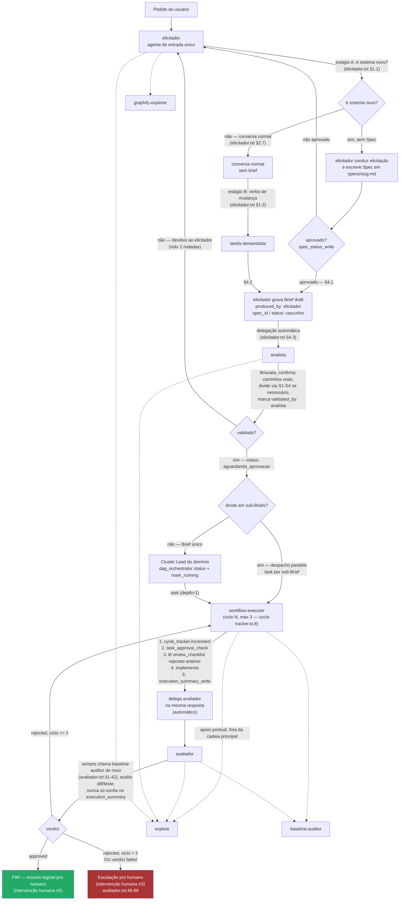

# Arquitetura de agentes do XOCP

Este documento descreve os agentes **realmente registrados** em
`packages/opencode/src/agent/agent.ts` (a fonte de verdade em runtime) e o
fluxo ponta a ponta que eles formam. Toda afirmação de "isso existe" ou
"isso está conectado" abaixo cita arquivo e linha — quando um mecanismo
existe no código mas não é alcançado por nenhum caminho real de execução,
isso é dito explicitamente na seção 5 (Limitações conhecidas), não
omitido.

## 0. Nota — `AGENTS.md` §1 e os agentes aqui documentados

`AGENTS.md` linhas 3–20 ("System Agent Directory — 14 Cognitive Agents")
lista nomes como **Cluster Dispatcher**, **core Lead**, **backend Lead**,
**frontend Lead** e outros. Desses, os quatro Cluster Leads (**core**,
**backend**, **frontend**, **integration**) **são agentes registrados** em
`packages/opencode/src/agent/agent.ts` (seção 1 desta revisão) e espelhados
no V2 (`packages/core/src/plugin/agent.ts`), com modo `subagent`, supervisão
read-only e delegação via `dag_orchestrator` + `task` pro `workflow-executor`.
O "Cluster Dispatcher" de `AGENTS.md` corresponde ao motor de DAG
(DagOrchestrator + ClusterDispatcher em `packages/core/src/cluster/`), exposto
aos agentes pela ferramenta `dag_orchestrator` — não é um agente LLM. Os demais
nomes de `AGENTS.md` (Auditor, Graphify Operator, Research Operator, etc.) são
sinônimos informais para agentes que existem com outro nome (`baseline-auditor`,
`graphify-explorer`, `compaction`). **Este documento, não `AGENTS.md`
§1, reflete o que roda de verdade.** `AGENTS.md` §3 ("Executor Pre-Flight
Self-Test Protocol", linhas 41–50) descreve `runExecutorSelfTest` como um
gate obrigatório do fluxo real — isso passou a ser verdade a partir da
Tarefa 8 (`specs/xocp/prompt-implementacao-melhorias-xocp-v2.md`); ver
§5.3 para os detalhes de conexão e a nota histórica.

## 1. Os 19 agentes nativos

Fonte: `packages/opencode/src/agent/agent.ts`, objeto `agents`. A coluna
**Model tier** é uma recomendação deste documento, não algo configurado
no código — nenhum dos agentes fixa um `model` em `agent.ts` (o campo
`model` existe no schema, linha 53–58, mas não é usado em nenhuma das
entradas native); todos herdam o modelo padrão da sessão ou o override do
usuário em `opencode.json`.

**Nota (Tarefa 10):** o `pattern-auditor`
(`agent.ts:418-438`) foi somado aos agentes documentados abaixo — ver
linha da tabela e §1.2.

**Nota (Tarefa 12):** os 4 Cluster Leads (`core-lead`, `backend-lead`,
`frontend-lead`, `integration-lead`) foram adicionados como subagents,
elevando o total a 18 — ver linha da tabela e §1.4.

**Nota (Tarefa 14):** o `workflow-triador` foi **removido**. A triagem de
entrada (sistema novo / conversa normal / tarefa demandada) e a produção
do Brief draft passaram para o `elicitador` (agente de entrada único e
único produtor de Briefs); o `analista` deixou de especificar do zero e
passou a **ler/validar/dividir** Briefs já gravados (`produced_by:
elicitador`). Ver §1.5.

| Agente | Modo | Pipeline? | Model tier (recomendado) | O que faz | Resumo do prompt real |
|---|---|---|---|---|---|
| `build` | primary | Não | Depende da tarefa (padrão do usuário) | Agente genérico padrão, executa qualquer tool conforme permissão configurada. Sem prompt customizado (`agent.ts:149-164`, sem campo `prompt`). | — (usa o system prompt genérico do OpenCode, não um `.txt` do pipeline XOCP) |
| `plan` | primary | Não | Depende da tarefa | Modo somente-leitura/planejamento — `edit`/`write`/`apply_patch` bloqueados por padrão, só `.opencode/plans/*.md` liberado (`agent.ts:165-191`). | — (idem, sem prompt customizado) |
| `elicitador` | primary | **Sim** | Tier alto (ambiguidade, julgamento, conversas longas) | **Agente de entrada único e único produtor de Briefs (draft).** Tria (estágio A: é sistema novo? estágio B: verbo de mudança?) e, se aplicável, conduz elicitação do zero e gera Spec em `specs/<slug>.md`; depois de aprovada, grava o Brief draft (`produced_by: elicitador`) e delega ao `analista`. Nunca implementa código. | 3 fases: (1) triagem em dois estágios — 1.1 "é sistema novo?" e 1.2 gatilho por verbo (`elicitador.txt:25-...`); (2) conduz a conversa por rascunho-e-confirmação, não formulário; (3) baseline interno de 6 regras técnicas travadas + stack recomendada + checagem de frescor via busca. Seção 4 (Produção de Briefs) define a situação A (derivado de Spec, `spec_id`) e a situação B (tarefa demandada), sempre `status: rascunho` e delegação final ao `analista` (seção 4.3). |
| `analista` | primary | **Sim** | Tier alto (investigação + validação verificável) | **Lê, avalia, valida e divide Briefs já produzidos** pelo `elicitador` — nunca especifica do zero. Confirma os caminhos reais de `files_expected_touched`, decide dividir via régua S1–S4, marca `validated_by: analista` + `status: aguardando_aprovacao` e despacha ao `workflow-executor`. Nunca implementa. | Invariante: só inicia atividade se existir `.opencode/briefs/*.yaml`. Fluxo obrigatório: confirmar o que já existe na branch remota, mapear arquivos reais, checar padrão duplicado, cortar escopo por domínio, definir comando de verificação exato. Nunca edita brief in-place — incrementa `version` + `history`; máximo 2 rodadas de devolução do brief ao `elicitador` antes de escalar. |
| `workflow-executor` | primary | **Sim** | Tier alto (implementação de código real) | Implementa Briefs/Specs já aprovados, com trilha de auditoria (`cycle_tracker`, `self_test_tracker`, `execution_summary_write`). | Sequência fixa por ciclo: `cycle_tracker.increment` → `task_approval_check` → ler `review_checklist_read` do ciclo anterior se `rejected` → implementar → loop de autoteste obrigatório via `self_test_tracker` (contador isolado do `cycle_tracker`, máx. 3 tentativas, escalação separada se estourar — Tarefa 8) → opcionalmente `baseline-auditor` → `execution_summary_write` → delegar `avaliador` na mesma resposta (`workflow-executor.txt:7-100`, numeração após a regra de primeiro passo e o passo de autoteste adicionados nesta e na revisão anterior). Nunca chama `edit`/`write`/`apply_patch`/bash mutável antes do `task_approval_check` passar (`:105-106`). |
| `avaliador` | primary | **Sim** | Tier alto (julgamento independente, adversarial) | Revisa a entrega do executor de forma independente — nunca aceita o autorrelato sem verificação própria — e grava `review_checklist`. Read-only no código. | Lê `execution_summary_read`, mas isso nunca basta sozinho — sempre roda teste/lê diff/confere critério por critério (`avaliador.txt:5-13`); item `completed` com `external_source` nunca conta como verificado internamente (`:15-22`); sempre chama `baseline-auditor` de novo, mesmo que o executor já tenha rodado (`:31-42`); `rejected` volta pro executor se ciclo ≤3, `failed` sempre escala direto pro humano mesmo com ciclo livre (`:44-69`). |
| `general` | subagent | Não | Tier médio | Propósito geral, pesquisa/execução multi-step em paralelo. Sem prompt customizado (`agent.ts:332-345`). | — |
| `explore` | subagent | Não | Tier baixo/rápido (busca, não geração) | Busca rápida em código por padrão/keyword/pergunta estrutural, com 3 níveis de profundidade declarados por quem chama. | Especialista em glob/grep/read; nunca cria arquivo nem roda bash mutável (`explore.txt:1-18`). |
| `graphify-explorer` | subagent | Não | Tier baixo/rápido | Perguntas estruturais de código (chamadas, imports, herança, caminhos de dependência) via `graphify_query`. | Sempre usa `graphify_query` para pergunta estrutural, nunca adivinha por nome de arquivo (`graphify-explorer.txt:1-17`). |
| `baseline-auditor` | subagent | Não | Tier médio (mistura mecânico + julgamento) | Audita as 11 regras fixas do Baseline Global (`specs/xocp/baseline-global.md`) contra o código. Read-only, nunca edita. | 6 regras de segurança majoritariamente mecânicas (grep por padrão) + 5 regras de UI/UX que misturam mecânico e julgamento; marca `not_applicable` explicitamente quando não se aplica, nunca omite da lista (`baseline-auditor.txt:9-59`). |
| `pattern-auditor` | subagent | Não (apoio ao pipeline, chamado pelo `avaliador`) | Tier médio (síntese de dados + julgamento de "isso é candidato a regra nova?") | Relata recorrência de padrões no pipeline — mesmo perfil read-only de `baseline-auditor` (`agent.ts:420-431`: `"*": "deny"` + `grep`/`glob`/`read`/`pattern_recurrence_read`/`external_directory` liberados). Nunca implementa, nunca edita, nunca abre delegação própria de correção. | Chama `pattern_recurrence_read` (sem parâmetros, relatório do projeto inteiro) e separa SEMPRE em duas categorias, nunca misturadas: "erro recorrente" (mesmo critério/regra reprovando em ≥3 tarefas distintas — candidato a regra nova ou ajuste de prompt, mas só sugere) e "rotina recorrente" (candidato a tool/skill nova, sinalizada quando ≥5 tarefas distintas rotulam o mesmo `rotina_id` via `record_rotina_event`; limiar acima do erro e nunca preenchida por heurística forçada) (`pattern-auditor.txt:29-38`). Princípio citado explicitamente do próprio prompt: "o sistema aprende via spec mais afiada, não via modelo mudando sozinho" (`pattern-auditor.txt:4-7`, ecoando `workflow-pipeline-v2.md` §8). |
| `compaction` | primary, oculto | Não | Tier baixo/rápido (alto volume, tarefa mecânica) | Interno — resume conversa longa num formato estruturado pra outro agente continuar. | Segue exatamente a estrutura pedida, nunca continua a conversa nem responde perguntas (`compaction.txt:1-5`). |
| `title` | primary, oculto | Não | Tier baixo/rápido | Interno — gera título de sessão (≤50 caracteres, uma linha). | Regras rígidas de formato + exemplos; nunca usa tools (`title.txt:1-44`). |
| `summary` | primary, oculto | Não | Tier baixo/rápido | Interno — gera resumo de sessão em 2-3 frases, estilo descrição de PR. | Primeira pessoa, não menciona testes/builds, preserva pergunta pendente se houver (`summary.txt:1-11`). |
| `core-lead` | subagent | **Sim** (Cluster Lead, domínio core) | Tier alto (supervisão + delegação) | Orquestra a execução do cluster core via `dag_orchestrator`; nunca implementa sozinho nem escreve Briefs. | `"*": "deny"` + `grep`/`glob`/`read` + `dag_orchestrator` + `task: workflow-executor` (subagent, depth=1). Roda `status`, pega `readyWaves()[0]`, `mark_running` por brief, delega ao executor uma chamada por brief, e após o Avaliador `apply_verdicts` avança a próxima wave (`core-lead.txt`; ver §1.4). |
| `backend-lead` | subagent | **Sim** (Cluster Lead, domínio backend) | Tier alto | Idem ao `core-lead` para o domínio backend. | Idem (`backend-lead.txt`; ver §1.4). |
| `frontend-lead` | subagent | **Sim** (Cluster Lead, domínio frontend) | Tier alto | Idem ao `core-lead` para o domínio frontend. | Idem (`frontend-lead.txt`; ver §1.4). |
| `integration-lead` | subagent | **Sim** (Cluster Lead, domínio integration/cross) | Tier alto | Idem ao `core-lead` para integração — pode cruzar fronteiras de cluster quando o escopo do Brief declarar. | Idem (`integration-lead.txt`; ver §1.4). |

### 1.1 `task` (delegação) — o que cada um pode chamar, e uma ressalva técnica sobre a coluna abaixo

| Agente | Pode delegar (`task`) para — intenção declarada em `agent.ts` |
|---|---|
| `elicitador` | `explore`, `graphify-explorer`, `analista` (nega `general`) — `agent.ts:203-208`. O `analista` substitui o antigo `workflow-executor` como destino da delegação final (Tarefa 14); `analista` é quem despacha ao Executor. |
| `analista` | `explore`, `workflow-executor` (nega `general`) — `agent.ts:258-262`. O `workflow-executor` é usado no despacho paralelo de sub-Briefs validados (não para o caminho sequencial normal). |
| `workflow-executor` | `explore`, `avaliador`, `baseline-auditor` — `agent.ts:285-289` |
| `avaliador` | `explore`, `workflow-executor`, `baseline-auditor`, `pattern-auditor` (nega `general`) — `agent.ts:319-325`. O `pattern-auditor` foi adicionado na Tarefa 10, condicionado ao marcador `<recurrence_report_trigger>` no output de `review_checklist_write` (ver §1.2). |

**Ressalva verificada, não no pedido original mas relevante para não
enganar quem for editar `agent.ts`:** a avaliação de permissão
(`packages/opencode/src/permission/index.ts:28-38`, função `evaluate`)
usa `findLast` sobre o ruleset mesclado — o último rule que casar
`permission` + `pattern` (via wildcard) vence. O bloco de `defaults`
(`agent.ts:127-144`) define `"*": "allow"` global. Isso tem uma
consequência real: `elicitador`, `analista` e `workflow-executor` **não**
definem um `"*": "deny"` próprio — então, tecnicamente, um `task` para um
agente que não está na lista acima (ex.: `elicitador` chamando
`avaliador` diretamente) **não é bloqueado pela permissão**, cai no
`"*": "allow"` dos defaults. Só o padrão `general` é explicitamente
negado nesses três. Já `avaliador` e os 4 Cluster
Leads definem
`"*": "deny"` como primeira regra do seu bloco (para o avaliador, e
para os leads apenas as tools de leitura + `dag_orchestrator` + `task:
workflow-executor` são liberados), então **para esses, só os padrões
explicitamente
listados como `allow` são alcançáveis** — um `task` pra um nome fora da
lista é de fato negado. Na prática isso não importa porque nenhum prompt
instrui esses agentes a chamar algo fora da lista documentada acima — mas
é uma diferença real de enforcement entre os dois grupos, não um detalhe
cosmético.

### 1.2 Três mecanismos novos (Tarefas 9, 10, 11)

**Tarefa 9 — diário de bordo do Executor.** Arquivo por tarefa,
`.opencode/execution-log/<task_id>.md`, texto livre técnico (não JSON),
append-only, uma seção por ciclo (`## Ciclo N / O que fiz / Por que
escolhi essa abordagem / O que ficou em dúvida`). Escrito pelo
`workflow-executor` no mesmo turno de `execution_summary_write`
(`workflow-executor.txt:110-120`) e lido por ele mesmo no início do
próximo ciclo, ANTES de reagir ao veredito do Avaliador
(`workflow-executor.txt:25-36`, novo passo 3, antes do passo 4 de leitura
do `review_checklist_read`) — memória de raciocínio próprio, não um
checklist estruturado. Gitignored com o mesmo padrão de
`.opencode/briefs/.gitignore` (`*` + `!.gitignore`, verificado antes de
criar — não assumido por convenção). Nunca lido pelo Avaliador ou pelo
humano por padrão; sem shielding de permissão como o autoteste da
Tarefa 8 porque não há requisito de sigilo aqui, só de não poluir os
outros fluxos (nenhuma tool nova foi criada — `edit`/`write` já bastam).

**Tarefa 10 — registro de recorrência / auto-evolução.** Três fontes de
evento fixas, gravadas via `recordPatternEvent`
(`packages/core/src/evolution/pattern-events.ts:52-60`, tabela
`pattern_events` em `.opencode/pattern-events.db`, padrão `bun:sqlite`
idêntico a `cycle-tracker.ts`/`self-test-tracker.ts` — banco próprio,
nunca reaproveita as tabelas desses dois):
1. `review_checklist_write` grava um evento por critério reprovado
   (`packages/opencode/src/tool/review-checklist-write.ts:47`).
2. `baseline-audit-write` grava um evento por item reprovado
   (`packages/opencode/src/tool/baseline-audit-write.ts:35`).
3. `self_test_tracker` grava um evento (`category_id:
   "self_test_exhausted"`) quando o autoteste da Tarefa 8 esgota as 3
   tentativas (`packages/opencode/src/tool/self-test-tracker.ts:49`).

Alerta de "erro recorrente": mesmo `category_id`+`source` reprovando em
≥3 **tarefas distintas** (não ciclos de retentativa dentro da mesma
tarefa — isso já é o que `cycle_tracker` cobre) dentro de uma janela de
20 tarefas concluídas OU 30 dias, o que vier primeiro
(`pattern-events.ts:12-14,95-107,118-144`). Contador cumulativo de
tarefas concluídas: não existia nenhum antes desta tarefa (verificado —
o único candidato era o contador em memória, por-execução, nunca
persistido de `ClusterDispatcher`, `cluster/dispatcher.ts:67`, inútil
entre sessões); criado do zero como tabela `task_completions`
(`pattern-events.ts:42-46,68-81`), incrementado por
`recordTaskCompletion` a cada `verdict: "approved"` em
`review_checklist_write` (`review-checklist-write.ts:57`). A cada
múltiplo de 10, o output da tool inclui um bloco
`<recurrence_report_trigger>` (`review-checklist-write.ts:60-61`), que
`avaliador.txt:75-81` (passo 9, novo) instrui a virar delegação via
`task` pro `pattern-auditor` na mesma resposta — automático, sem esperar
pedido do humano.

O relatório (`pattern_recurrence_read`,
`packages/opencode/src/tool/pattern-recurrence-read.ts`) sempre separa
duas categorias, nunca mistura: "erro recorrente" (populada, com
`category_id`, contagem de tarefas distintas e sugestão textual — nunca
implementa a correção) e "rotina recorrente" (populada desde a Tarefa 12: o Executor rotula, via
`record_rotina_event`, uma rotina reutilizada em ≥5 tarefas distintas —
fonte `executor_rotina`, limiar acima do erro (3) porque repetição
voluntária e sem reprovação precisa de mais evidência; nunca preenchida
por heurística forçada — `pattern-events.ts`: `queryRecurringRoutines` /
`routineProgress`; tool em
`packages/opencode/src/tool/record-rotina-event.ts`, invisível pro
Avaliador por blindagem de permissão). O agente `pattern-auditor` (subagent, mesmo
perfil read-only de `baseline-auditor`, ver tabela da seção 1) nunca
implementa a melhoria sozinho — só relata, mesmo princípio de
`workflow-pipeline-v2.md` §8 já citado no próprio prompt
(`pattern-auditor.txt:4-7,43-46`).

**Tarefa 11 — paralelismo real entre Briefs independentes.** Decisão de
arquitetura resolvida por investigação, não suposição: existe uma classe
pronta pra orquestrar DAG de Briefs, `ClusterDispatcher`
(`packages/core/src/cluster/dispatcher.ts:20`, já documentada como
subsistema sem caller em §5.1), mas ela opera sobre `TechnicalBriefV2`
(`files_scope`/`contracts`/`verification_gates`), um schema diferente do
Brief real (`files_expected_touched`/`constraints`/`acceptance_criteria`,
seção 4 de `workflow-pipeline.md`). Confirmado também que
`ctx.extra.promptOps` — o mecanismo que permitiria uma tool comum
disparar `task` internamente — é populado genericamente pra qualquer
tool em `packages/opencode/src/session/tools.ts:64`, não só pra
`task.ts` (`packages/opencode/src/tool/task.ts:197-198`); ou seja, a
Rota 1 (tool nova que usa o `executor` do `ClusterDispatcher`
internamente) era tecnicamente viável. Optou-se pela Rota 2 mesmo assim,
por dois motivos combinados: o desalinhamento de schema já citado (forçar
o Brief real no formato `TechnicalBriefV2` só pra usar a classe seria
duplicação de schema, contra a regra do próprio `analista.txt:25-28`) e a
existência de um precedente já documentado no projeto pro mesmo padrão —
bash paralelo em `packages/opencode/src/tool/shell/prompt.ts:108,159,208`
("se os comandos são independentes... múltiplas chamadas numa única
mensagem"). `ClusterDispatcher` fica como está — referência de design e
teste de unidade da lógica de DAG (`packages/core/test/cluster/dispatcher.test.ts`,
inalterado por esta tarefa, 2/2 passando), não peça viva do fluxo.

Regra de divisão nova em `analista.txt:69-102` (passo 6): candidato a N
sub-Briefs quando ≥2 conjuntos de `files_expected_touched` não se
sobrepõem E não há razão de espera entre eles (teste prático: "consigo
mockar a ponta que falta pra este pedaço existir sozinho?"); teto de 4
sub-Briefs por tarefa original; não divide se o pedaço resultante tocaria
menos de 1 arquivo relevante ou um único critério trivial. Sub-Briefs sem
dependência entre si são delegados via múltiplas chamadas `task` pro
`workflow-executor` na mesma resposta do Analista — por isso
`"workflow-executor": "allow"` foi somado ao `task` allow-list do
`analista` (`agent.ts:261`, tabela da seção 1.1). Isso fecha parcialmente
o gap descrito na observação 2 da seção 2 e no achado 5.4: continua não
existindo delegação automática no caminho sequencial normal
Analista→Executor (a troca de agente ainda é manual pra um Brief único
aprovado), mas para o caso específico de sub-Briefs paralelos e
independentes, a automação agora existe e está testada
(`packages/opencode/test/agent/agent.test.ts`, "Tarefa 11: analista can
delegate to workflow-executor via task (parallel sub-Brief dispatch)").

### 1.4 Tarefa 12 — Cluster Leads e o DagOrchestrator como peça viva (runtime wiring)

A convicção registrada nas Tarefas 9–11 era de que `ClusterDispatcher`
operava sobre um schema (`TechnicalBriefV2`) diferente do Brief real, e
portanto ficava como referência de design sem caller em produção (§5.1).
A Tarefa 12 fechou esse gap com um loader de domínio novo —
`packages/core/src/brief/brief-v2.ts` (`parseBriefYaml` + `inferDomainCluster`
+ `loadPipelineBriefs`) — que converte o Brief real
(`status: aprovada` em `.opencode/briefs/*.yaml`, schema da seção 4 de
`workflow-pipeline.md`) para `TechnicalBriefV2`, inferindo o cluster de
`files_expected_touched`. Sobre isso, `packages/core/src/cluster/orchestrator.ts`
(`DagOrchestrator`) abre, hidrata o estado durável
(`.opencode/dag.db`, `cluster/dag-store.ts`), agrupa briefs prontos em
"ready waves" sem sobreposição de `allow_modify`
(`scope-conflict.ts`, `selectNonOverlapping`), reserva via `markRunning` e
aplica vereditos do Avaliador lidos do disco (`verdict.ts`,
`applyReviewVerdictsFromDisk` — approved encerra o nó e desbloqueia
`depends_on`; rejected/failed encerra aquele ramo sem bloquear
independentes).

A exposição pro runtime é a tool **`dag_orchestrator`**
(`packages/opencode/src/tool/dag-orchestrator.ts`, registrada em
`tool/registry.ts`) com as ações `status` / `mark_running` /
`apply_verdicts`. Para dirigi-la foram criados 4 subagents read-only —
**core-lead**, **backend-lead**, **frontend-lead**, **integration-lead**
(`agent.ts`, permissão `"*": "deny"` + `grep/glob/read` + `dag_orchestrator`
+ `task: workflow-executor`; prompts em `agent/prompt/*-lead.txt`,
espelhados em `packages/core/src/plugin/agent.ts`). Cada lead roda `status`,
toma `readyWaves()[0]`, chama `mark_running` por brief e delega via `task`
ao `workflow-executor` (uma chamada por brief, depth=1); após o Avaliador
gravar o review_checklist, roda `apply_verdicts` e segue pra próxima wave.

O mesmo commit também fechou o gap sequencial da observação 2 da seção 2:
o `workflow-triador` (hoje **removido** na Tarefa 14) ganhou
`task: { analista: "allow" }` e instrução no prompt de delegar ao
`analista` na MESMA resposta quando classificar `DIVIDIR`, repassando o
YAML da triagem e a `estimativa_de_ramos`. Testes em
`packages/opencode/test/agent/agent.test.ts` (leads registrados,
permissões, triador→analista) e `test/tool/dag-orchestrator.test.ts`
(status/mark_running/apply_verdicts).

## 2. Fluxo ponta a ponta

Dois pontos de entrada convergem no mesmo ciclo executor↔avaliador.
Citações: `specs/xocp/workflow-pipeline.md:44-46` (FLUXO_NORMAL sai do
pipeline), `specs/xocp/workflow-pipeline-v2.md:396-421` (ciclo),
`elicitador.txt:305-314` (delegação automática do elicitador),
`workflow-executor.txt` (delegação automática pro avaliador),
`avaliador.txt:44-69` (decisão de reprovar/escalar).



**Duas observações do diagrama que não estavam no pedido original, mas
são necessárias pra ele não mentir:**

1. **A conversa normal NÃO entra no pipeline** — o `elicitador` responde
   como conversa normal (`elicitador.txt` §2.7) e nenhum Brief é criado.
   Só uma **demanda de execução com verbo de mudança** (`elicitador.txt`
   §1.2) gera Brief draft e entra no pipeline completo
   (elicitador → analista → workflow-executor → avaliador). Não existe
   mais o "FLUXO_NORMAL" do antigo `workflow-triador`.
2. **O caminho `elicitador` → `analista` é automático** — depois de
   gravar o Brief draft (situação A ou B), o `elicitador` delega ao
   `analista` na mesma resposta (`elicitador.txt` §4.3, permissão
   `task: analista`). O `analista` valida, confirma os caminhos reais,
   decide dividir via S1–S4 e: para sub-Briefs paralelos, delega direto
   ao `workflow-executor` via `task` (`analista.txt` §7); para Brief
   único, a execução é dirigida pelo Cluster Lead do domínio via
   `dag_orchestrator` + `task` (`mark_running` + delegação — §1.4). O
   único ponto que segue manual para Brief único não-dividido é disparar
   o primeiro `status` do Lead (seleção do agente pelo usuário); a partir
   daí o Lead avança as waves automaticamente.

## 3. Os 3 únicos pontos de intervenção humana no fluxo automático

Fonte: `specs/xocp/workflow-pipeline-v2.md:434-443` (seção 6.1).

1. **Aprovar a Spec/Brief** — confirmação real via `ask` na ferramenta
   `spec_status_write` (mesma ferramenta serve Brief e Spec).
2. **Ler o resumo final** quando o Avaliador aprova — não exige ação,
   só leitura.
3. **Responder a uma escalação** — limite de ciclo atingido (>3,
   `cycle-tracker.ts:8,112`) ou `verdict: "failed"` (critério do
   Brief/Spec incoerente, não é erro de código de implementação —
   `avaliador.txt:57-69`).

Tudo o mais — troca de agente, leitura de checklist anterior,
delegação pro avaliador, retentativa em caso de `rejected` dentro do
limite — é automático desde o `elicitador` (agente de entrada único):
depois de gravar o Brief draft ele delega ao `analista` na mesma resposta
(§1.5), e o `analista` despacha os sub-Briefs ao executor ou aciona o
Cluster Lead. O único ponto de troca manual restante: depois de um Brief
único validado, alguém precisa selecionar o Cluster Lead do domínio (ou o
`workflow-executor`) para iniciar a primeira rodada de `dag_orchestrator
status` — ver ressalva na seção 2.

## 4. Exemplos de payload

### 4.1 Brief YAML real (template de `specs/xocp/workflow-pipeline.md:194-232`)

```yaml
brief_id: brief-auth-rate-limit-01
version: 1
status: aguardando_aprovacao
task_summary: "Adiciona rate limiting no endpoint de login"

scope:
  included:
    - "Middleware de rate limit em packages/server/src/auth/login.ts"
  excluded:
    - "Rate limit em outros endpoints além de login — fora deste brief"

acceptance_criteria:
  - id: AC1
    description: "Login bloqueia após 5 tentativas falhas em 1 minuto por IP"
    verifiable_by: "cd packages/server && bun test test/auth/rate-limit.test.ts"

constraints:
  - "Não modificar SessionRunner, mesmo que pareça o caminho mais direto"

depends_on: []

files_expected_touched:
  - "packages/server/src/auth/login.ts"
  - "packages/server/src/auth/rate-limit.ts"

risk_notes:
  - "Middleware de rate limit em memória não sobrevive restart — aceitável pro MVP"

created_by: analista
created_at: "2026-09-15T12:00:00Z"
history:
  - version: 1
    change: "criação inicial"
    by: analista
```

Note: `files_expected_touched` é explicitamente **não vinculante** — é
orientação do Analista, não uma lista fechada que trava o Executor
(`workflow-pipeline.md:220-221`, `"não é vinculante, é orientação"`). É
por isso que o reforço de escopo em `cycle_tracker` (ver `packages/opencode/src/tool/cycle-tracker.ts:7-25`,
adicionado nesta mesma leva de mudanças) trata `files_expected_touched`
como orientação e `constraints` como a lista de fato proibida.

### 4.2 `execution_summary_write` — payload real

Schema: `packages/opencode/src/tool/execution-summary-write.ts:7-12`.

```json
{
  "task_id": "brief-auth-rate-limit-01",
  "completed": [
    { "item": "AC1", "evidence": "bun test test/auth/rate-limit.test.ts — 3 passed" }
  ],
  "incomplete": [],
  "status": "complete"
}
```

### 4.3 `review_checklist_write` — payload real

Schema: `packages/opencode/src/tool/review-checklist-write.ts:7-13`.

```json
{
  "task_id": "brief-auth-rate-limit-01",
  "gates": { "execution_summary_complete": "pass" },
  "criteria": [
    { "id": "AC1", "status": "pass", "evidence": "rate-limit.test.ts linha 12: 6ª tentativa retorna 429" }
  ],
  "verdict": "approved"
}
```

### 4.4 `task` — delegação real (executor → avaliador)

Schema: `packages/opencode/src/tool/task.ts:44-49`.

```json
{
  "subagent_type": "avaliador",
  "description": "Revisar brief-auth-rate-limit-01",
  "prompt": "execution_summary_write concluído para brief-auth-rate-limit-01. Revise de forma independente."
}
```

## 5. Limitações conhecidas

Destas 4, 5.1/5.2/5.4 existem no código mas **não estão conectadas ao
fluxo real** — documentadas aqui como limitação, não como feature. 5.3 foi
resolvida na Tarefa 8 (ver nota na própria seção) e fica registrada como
histórico, não como limitação atual. 5.4 permanece uma limitação real,
mas parcialmente atenuada pela Tarefa 11 para o caso de sub-Briefs
paralelos (ver nota na própria seção e §1.2) — não confundir "atenuada
num caso específico" com "resolvida", que é o status de 5.3.

### 5.1 `ClusterDispatcher` / `TechnicalBriefV2.files_scope` — RESOLVIDO na Tarefa 12

Até a Tarefa 12, `packages/core/src/cluster/dispatcher.ts:20` definia
`ClusterDispatcher`, que consome `TechnicalBriefV2.files_scope`
(`allow_modify`/`strictly_forbidden`, `packages/core/src/brief/types.ts:3-7`),
sem nenhum caller em produção — o único consumidor era o próprio pacote
`packages/core` (o dispatcher e seus testes). O Brief real, escrito pelo
Analista (`files_expected_touched` + `constraints`, seção 4 de
`workflow-pipeline.md`), não era convertido pro schema da classe. Isso foi
conectado na Tarefa 12: `brief-v2.ts` converte o Brief real →
`TechnicalBriefV2`, `orchestrator.ts` (`DagOrchestrator`) orquestra, e a
tool `dag_orchestrator` (`packages/opencode/src/tool/dag-orchestrator.ts`)
expõe isso aos Cluster Leads (`agent.ts`, ver §1.4). A descrição de
`AGENTS.md:14` ("writes code within declared `files_scope`") agora bate com
o mecanismo real, que roda em runtime e é testado de ponta a ponta.

### 5.2 `evaluateDualLens`/`diffFiles` em `avaliador.ts` — sem call-site em produção

`packages/core/src/workflow-review/avaliador.ts:73` (`evaluateDualLens`)
só é chamada pelo próprio teste unitário
(`packages/core/test/workflow-review/avaliador-dual-lens.test.ts`). O
Avaliador real (o agente LLM, não essa função) audita via `bash`/`git
diff` seguindo instrução de prompt (`avaliador.txt:9-13`, "roda teste,
lê o diff"), não chamando essa função. Nesta mesma revisão de código, a
função foi corrigida para comparar contra o diff cumulativo da base
branch por padrão (`avaliador.ts:73-75`, anti-salami-slicing) — a
correção é real e testada, mas isso não muda o fato de que a função
segue sem nenhum chamador em produção.

### 5.3 `runExecutorSelfTest` — RESOLVIDO na Tarefa 8 (deixado aqui como registro histórico)

Até a Tarefa 8 (ver `specs/xocp/prompt-implementacao-melhorias-xocp-v2.md`),
`packages/core/src/workflow-executor/self-test.ts:26`
(`runExecutorSelfTest`) não tinha nenhum tool wrapper nem menção em
`workflow-executor.txt` — exatamente a mesma categoria de gap dos outros 3
achados desta seção. Isso foi conectado: a tool `self_test_tracker`
(`packages/opencode/src/tool/self-test-tracker.ts:2,52`, registrada em
`packages/opencode/src/tool/registry.ts:21,119`) chama
`runExecutorSelfTest` diretamente, e `workflow-executor.txt:36-45`
instrui o passo 6 (obrigatório) do ciclo a usá-la. O contador de
tentativas é isolado do `cycle_tracker` do Avaliador por um segundo banco
SQLite (`packages/core/src/workflow-executor/self-test-tracker.ts`,
tabela `self_test_cycles` em `self-test-cycles.db`, separado de
`workflow-cycles.db`) — e a tool nunca aparece pro `avaliador`, porque o
perfil dele já usa `"*": "deny"` (`agent.ts:306`) e a tool nova não foi
adicionada à lista de exceções, confirmado por teste
(`packages/opencode/test/agent/agent.test.ts`, "Reviewer Blindness: self_test_tracker
is never visible to avaliador..."). `AGENTS.md:41-50` já descrevia esse
autoteste como "Hard Local Gate" — a diferença é que agora essa descrição
bate com o código.

### 5.4 Não existe orquestrador determinístico — a cadeia funciona por convenção de prompt, não por mecanismo de framework

`specs/xocp/workflow-pipeline-v2.md:471-476` (seção 6.1, "Limite
honesto"), citação direta: *"isso ainda depende de cada agente **chamar**
a delegação corretamente, conforme instruído no próprio prompt — não é
um orquestrador externo, determinístico, forçando a sequência."* A seção
7 do mesmo documento ("O que o v2 NÃO resolve", linha 480) reafirma:
*"Agentes podem ignorar instruções e pular tools — redução de risco, não
garantia."* Tecnicamente, a permissão (`task: { workflow-executor: allow
}` etc.) só define o que é **possível**; quem decide **quando** delegar
é o texto do prompt, interpretado por um modelo de linguagem — não há
verificação de máquina de estados em código forçando elicitador → analista
→ executor → avaliador.

**Atenuações implementadas:** (a) a Tarefa 11 fechou o gap de sub-Briefs
paralelos (analista → workflow-executor com instrução de delegação no
prompt); (b) a Tarefa 12 fechou o gap do caminho sequencial
triador→analista (agora removido: na Tarefa 14 o `elicitador` produz o
Brief draft e delega ao `analista` diretamente) e adicionou um
**orquestrador real com estado durável** (`DagOrchestrator` + tool
`dag_orchestrator` + Cluster Leads, ver §1.4): a sequência de ondas e o
`depends_on` entre Briefs deixam de depender só da convenção de prompt e
passam a ser derivados do DAG persistido — os Leads *consultam* o
orquestrador (`status`/`readyWaves`) e *só então* delegam. Isso reduz
(ainda que não elimine por completo) a dependência da boa interpretação
do prompt: a topologia de dependência é agora um fato computado em
`dag.db`, não uma lembrança do modelo. O caminho `analista` → `workflow-executor`
para Brief único ainda segue manual (troca de agente pelo usuário), e a
delegação do `avaliador` → `pattern-auditor` continua dependendo do
marcador `<recurrence_report_trigger>` ser lido corretamente do output — ver
seção 2, §1.2 e §1.4.

## 6. Mapa de Estado (Estado × Gravador)

Fonte da verdade do que o runtime XOCP grava e onde. Toda linha cita o
gravador real (`arquivo:linha`), não a convenção de nome. Contratos de
trabalho (Brief/Spec) são **fontes de verdade de entrada** (lidos, não
gravados pelo ciclo de execução); a trilha de revisão, os contadores e a
telemetria são o que o ciclo **produz**.

### 6.1 Contratos de entrada (onde vive o que está aprovado)

| Caminho | Formato | Quem grava (ferramenta) | Resolução pela `task_id` |
|---|---|---|---|
| `.opencode/briefs/<id>.yaml` | YAML | `elicitador` (rascunho) / `analista` (valida/divide), via `edit`; transição de `status` via `spec_status_write` | `task-path.ts:16-21` (`contractRelativePath`) |
| `specs/<slug>.md` (ou `.opencode/specs/<slug>.md`) | MD + frontmatter | `elicitador` via `edit`; `status` via `spec_status_write` | `SPEC_TASK_ID` em `task_path` (`task-path.ts:3`) |
| `specs/xocp/baseline-global.md` | MD | humanos | lido por `baseline-auditor` (11 regras fixas) |

Leitura de aprovação: `task_approval_check` resolve o contrato pelo
`task_id` e recusa implementação se `status !== "aprovada"` (não é
bloqueio de OS — é convenção reforçada por tool; §5.4).

### 6.2 Trilha de revisão (`.opencode/reviews/<task_id>/`)

`reviewsRelativeDir` em `task-path.ts:23-26` (sanitiza `task_id` para
nomes de pasta seguros em Windows). Caminhos pelos contadores:

| Arquivo | Ferramenta de escrita | Gravador real | Conteúdo |
|---|---|---|---|
| `cycle-count.txt` | `cycle_tracker` | `cycle-tracker.ts:105-110` (sync legacy) | Contador de ciclo (legacy, espelhado do SQLite) |
| `cycle-<N>.json` | `review_checklist_write` | `review-checklist.ts:87` | Veredito + gates + critérios com evidência |
| `execution-<N>.json` | `execution_summary_write` | `execution-summary.ts:66` | Resumo cumulativo da execução |
| `baseline-<N>.json` | `baseline-audit-write` | `baseline-audit.ts:70` | Auditoria das 11 regras |
| `self-test-escalation.json` | `self_test_tracker` | `self-test-tracker.ts:144-148` | Marcador de autoteste esgotado (Reviewer Blindness) |

`N` vem apenas de `cycle_tracker` (invariante 0.5 do v2) — as ferramentas
de escrita leem o contador no disco, não aceitam `N` manual.

### 6.3 Contadores (Bancos SQLite, WAL, em `.opencode/`)

Padrão `bun:sqlite` + `PRAGMA journal_mode = WAL` + `dbCache` por caminho,
idêntico nos cinco. **Isolamento é deliberado**: cada um responde a um
domínio e nenhum reaproveita tabela de outro.

| Banco | Tabelas | Grava | Lê | Propósito |
|---|---|---|---|---|
| `workflow-cycles.db` | `task_cycles` | `cycle-tracker.ts:69-101` (`incrementCycle`) | `cycle-tracker.ts:41-67` (`readCycle`) | Ciclo por tarefa — teto de 3 (`MAX_CYCLES` :8) |
| `self-test-cycles.db` | `self_test_cycles` | `self-test-tracker.ts:92-117` (`incrementSelfTestCycle`), :62-78 (`recordSelfTestAttempt`) | `self-test-tracker.ts:50-56`, :80-90 | Autoteste do executor, isolado do Avaliador (teto 3 :12) |
| `pattern-events.db` | `pattern_events`, `task_completions` | `pattern-events.ts:60-68` (`recordPatternEvent`), :76-83 (`recordTaskCompletion`) | `pattern-events.ts:156-158`, `buildRecurrenceReport` :204-210 | Recorrência de erros/rotinas (auto-evolução) |
| `dag.db` | `dag_nodes`, `dag_completed` | `dag-store.ts:59-82` (`save`, após cada transição do dispatcher) | `dag-store.ts:84-107` (`load`, hidratação) | Topologia de Briefs + ondas + vereditos aplicados |
| `sources.db` | `sources`, `sources_fts` (FTS5) | `sources/index.ts:65-120` (`ingestSource`) via `sources_ingest` | `sources/index.ts:122-145` (`listSources`), `sources/index.ts:147` (`querySources`) | Memória de pesquisa (elicitador/analista) |

**Os 3 eventos fixos de recorrência (fonte: `recordPatternEvent`):**

| Ferramenta que grava | `category_id` | `source` | Linha |
|---|---|---|---|
| `review_checklist_write` (critério `fail`) | id do critério | `review_checklist` | `review-checklist-write.ts:47-52` |
| `baseline-audit-write` (item `fail`) | id do item | `baseline_auditor` | `baseline-audit-write.ts:35` |
| `self_test_tracker` (autoteste esgotado) | `self_test_exhausted` | `self_test_escalation` | `self-test-tracker.ts:49-54` |
| `record_rotina_event` (rotina rotulada) | `rotina_id` | `executor_rotina` | `record-rotina-event.ts:29-33` |

Leitura: `pattern_recurrence_read` (→ `pattern-auditor`), sempre separando
"erro recorrente" (≥3 tarefas distintas) de "rotina recorrente" (≥5).

### 6.4 Telemetria de incidentes (`.opencode/evolution/`)

| Arquivo | Ferramenta de escrita | Gravador real | Quando |
|---|---|---|---|
| `incident-<id>.json` | `evolution_incident_write` | `evolution/incident.ts:36` (`recordIncident`) | Quando o Evolution Incident Reporter é invocado |
| `incident-<id>.json` | **automático** | `cycle-tracker.ts:114-126` (`recordIncident` com `cycle_threshold_reached`) | Ao estourar o limite de ciclos |

`recordIncident` é compartilhado (`incident.ts:15-38`): gera `id`/`timestamp`,
grava em `.opencode/evolution/` e é chamado tanto pela tool manual quanto
pelo `cycle_tracker` — os incidentes **não dependem** de um agente se
lembrar de escrevê-los no limite.

### 6.5 Memória de trabalho do executor (`.opencode/execution-log/<task_id>.md`)

| Formato | Quem grava | Como | Conteúdo |
|---|---|---|---|
| Markdown append-only | `workflow-executor` | via `edit`/`write` direto (sem tool dedicada), instrução em `workflow-executor.txt:110-120` | `/ Ciclo N / O que fiz / Por que escolhi essa abordagem / O que ficou em dúvida` |

Lido pelo próprio executor no ciclo seguinte, **antes** de reagir ao
veredito do Avaliador (`workflow-executor.txt:25-36`). Memória de
raciocínio própria; não é lido pelo Avaliador nem pelo humano por padrão.

### 6.6 Fontes de pesquisa (`.opencode/sources/`)

| Caminho | Quem grava | Formato |
|---|---|---|
| `<id>.<ext>` (raw) | `sources_ingest` | arquivo bruto (HTML/PDF/snippet/transcript) |
| `normalized/<id>.md` | `sources_ingest` | Markdown normalizado (`sources/ingest.ts:148-159`) |
| `sources.db` (FTS5) | `sources_ingest` (mesmo fluxo) | índice + metadados |

### 6.7 Fora de `.opencode/`

| Caminho | Grava | Propósito |
|---|---|---|
| `opencode.db` (dir de dados global) | núcleo opencode (`database/database.ts:53`) | sessões, mensagens, handoff |
| `graphify-out/graph.json` | CLI `graphifyy` (via `graphify_q` da tool `graphify-query`) | grafo estrutural do projeto |
| `specs/xocp/architecture.md` | **histórico deprecated** | fonte única vigente é `agent-architecture.md` (este documento) |

### 6.8 Manutenção do espelho de prompts (core ↔ opencode)

Os prompts dos agentes existem em dois lugares:
`packages/opencode/src/agent/prompt/*.txt` (runtime V1, TUI) e
`packages/core/src/plugin/*.txt` (plugin V2, servidor/API). Eles **devem**
ser byte-idênticos; a verificação é por `git hash-object` (os 12 pares de
agentes XOCP). O ponto de manutenção é: editar primeiro o V1 (runtime
operacional), depois `Copy-Item`/re-edit para o V2 — nunca o inverso. Os
dois `agent.ts` (registro V1 em `packages/opencode/src/agent/agent.ts`,
registro V2 em `packages/core/src/plugin/agent.ts`) devem manter a mesma
matriz de agentes, permissões (`list`/`bash`/`pattern_recurrence_read`)
e diversos defaults (`doom_loop: ask`).

Divergência estrutural aceita (única): o `title` do V1 declara
`temperature: 0.5`; `AgentV2.Info` (`packages/schema/src/agent.ts:20-31`)
não tem campo `temperature` — só `request.body`, que o compat
(`packages/opencode/src/config/v2-compat.ts:404`) rebaixa para `options`,
não para o `temperature` lido pelo runtime V1 (`session/llm/request.ts:122`).
Espelhar exigiria adicionar o campo ao schema; mantido como divergência
documentada em vez de simulada via `request.body`.

## 7. Metodologia de verificação

Toda afirmação de conexão ("X chama Y", "X está registrado") foi
confirmada por `grep` direto no código nesta revisão — não por
convenção de nome de arquivo nem por o que a documentação-alvo (ex.
`AGENTS.md`, `specs/xocp/architecture.md`) afirma sobre si mesma. Onde a
documentação-alvo e o código divergiram (seção 0, seção 5), o código
venceu e a divergência foi registrada explicitamente em vez de
silenciada. `bun test`/`bun run typecheck` foram rodados em
`packages/core` e `packages/opencode` antes de esta revisão ser
finalizada (ver PR desta mudança para os números exatos) — este
documento em si não introduz código, então não altera esses resultados.
