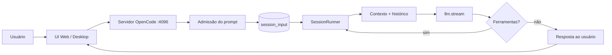
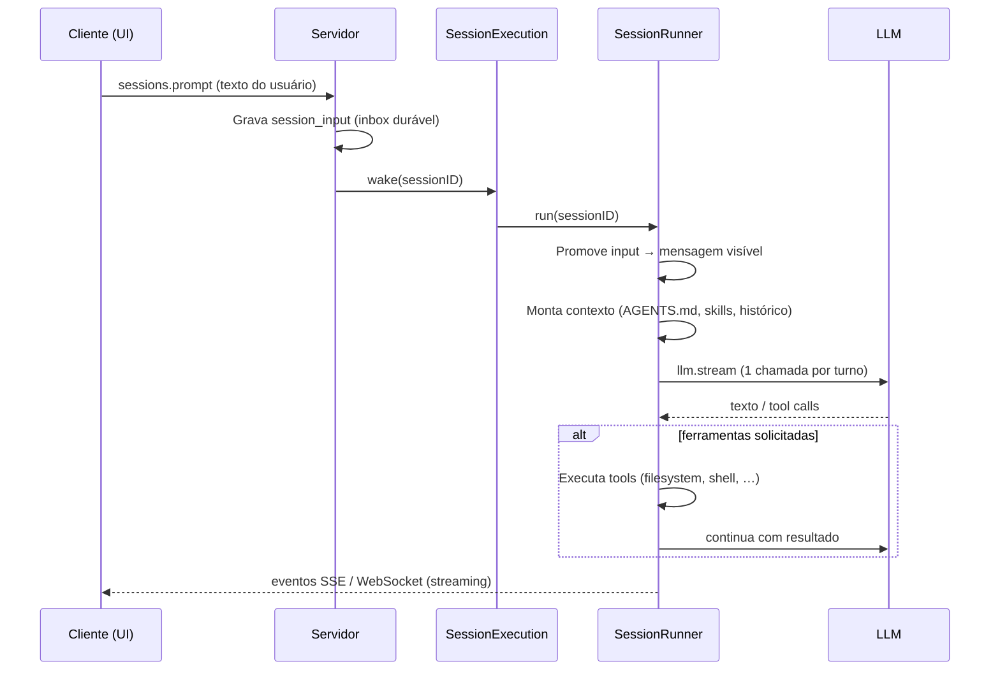

# Documentação XOCP

**eXtensible Open Code Platform** — agente de código com mapeamento
estrutural de projeto (Graphify), telemetria de sessão e continuidade de
trabalho entre sessões (handoff durável).

> Fork independente do [OpenCode](https://github.com/anomalyco/opencode)
> (MIT). Repositório: [github.com/ortizpedroso/xocp](https://github.com/ortizpedroso/xocp).

_Última atualização: gerada a partir de `specs/xocp/documentacao.md`._

---

## O que o XOCP faz

O XOCP é um **agente de programação** que:

1. Recebe prompts do usuário (texto, comandos `/`, contexto `@`)
2. Mantém **sessões duráveis** com histórico, ferramentas e permissões
3. Chama modelos de linguagem (LLM) com contexto do projeto
4. Executa **ferramentas** no ambiente local (arquivos, shell, busca,
   tarefas em background, incluindo subagentes paralelos via `task`)
5. Devolve respostas em streaming até concluir o turno ou pedir aprovação

Além da base herdada do OpenCode, o XOCP adiciona três capacidades
próprias, já em funcionamento:

| # | Recurso | O que faz | Status |
|---|---------|-----------|--------|
| 1 | Telemetria de sessão | Observa cada sessão (turnos, ferramentas usadas, duração) e calcula um score de complexidade | **Ativo** |
| 2/3 | Mapeamento estrutural (Graphify) | Sob demanda (opt-in), mapeia a estrutura do código em um grafo — chamadas, imports, herança — sem custo de LLM. Sugestão aparece quando a sessão fica complexa o suficiente | **Ativo** |
| 4 | Handoff durável | O agente pode gravar um resumo (até 2000 caracteres) ao fim de um trabalho, pra outra sessão retomar depois sem reconstruir contexto do zero | **Ativo** |
| 5 | Roteamento automático por domínio (clusters) | Dividir tarefas automaticamente entre agentes especializados por área do código | Adiado — testado, sem ganho comprovado em ambiente controlado; retomada depende de dado de uso real |
| 6 | Pré-busca de mapa em segundo plano | Mapear o projeto automaticamente antes do usuário pedir | Adiado — depende do item 1 validar valor em produção primeiro |

## Como o mapeamento de código funciona (Graphify)

Diferente de sistemas baseados em busca por similaridade de texto
(embeddings/RAG vetorial), o XOCP usa um **grafo real de código**: cada
arquivo/função vira um nó, cada chamada/import/herança vira uma aresta.
Isso é extraído localmente via AST (sem enviar código pra nenhuma API),
usando uma ferramenta externa (`graphifyy`) instalada e versionada
automaticamente na primeira vez que a função é usada — o usuário nunca
instala nada manualmente.

Quando uma sessão fica complexa o suficiente (score de telemetria acima
de um limite), o XOCP sugere mapear o projeto. O usuário decide se quer
— nunca acontece automaticamente.

## Continuidade entre sessões (Handoff)

O agente pode, a qualquer momento significativo (tipicamente perto do
fim de um trabalho), gravar um resumo do que foi feito, o que falta, e
decisões tomadas. Uma sessão futura no mesmo projeto recebe um aviso
discreto de que existe esse resumo, e pode optar por consultá-lo — sem
nunca ser forçado a ler o conteúdo completo automaticamente.

---

## Stack tecnológica

| Camada | Tecnologia |
|--------|------------|
| Runtime | [Bun](https://bun.sh) |
| Core / API | TypeScript, [Effect](https://effect.website), SessionV2 |
| Servidor HTTP | Hono (via Effect HTTP) |
| Banco local | SQLite (Drizzle ORM) |
| UI web / desktop | SolidJS, Vite, Tailwind |
| LLM | Provedores via `@opencode-ai/llm` (OpenAI, Anthropic, etc.) |
| Graphify | CLI externa (`graphifyy`, versão travada), invocada localmente — sem servidor, sem sidecar |

Pacotes principais do monorepo:

- `packages/opencode` — servidor e CLI
- `packages/app` — interface web compartilhada
- `packages/core` — sessão, ferramentas, permissões
- `packages/llm` — streaming com provedores

---

## Fluxo: da entrada à resposta

### Visão geral



### Detalhe do turno (SessionV2)



### Modos de entrega do prompt

| Modo | Comportamento |
|------|----------------|
| **steer** (padrão) | Entra na fila e é promovido no próximo limite seguro do turno |
| **queue** | Aguarda a sessão ficar ociosa antes de ser promovido |

Interrupção (`sessions.interrupt`) cancela o trabalho **neste processo**; o inbox durável é preservado para retomada.

---

## Como desenvolver localmente

```bash
bun install
bun dev web          # tudo em http://localhost:4096
# ou
bun dev:local        # UI :4444 + API :4096
```

A UI precisa do servidor API na porta **4096**. Só `bun dev:web` (frontend) deixa os controles desabilitados.

Detalhes: `specs/xocp/workflow.md` e `README.md`.

---

## Como este documento é atualizado

1. **Fonte:** `specs/xocp/documentacao.md` (este arquivo)
2. **Geração:** `bun run generate:xocp-docs` → `packages/app/src/generated/documentacao.ts`
3. **CI:** o workflow `xocp-ci` falha se a spec mudou sem regenerar
4. **Regra para agentes:** ao alterar fluxo de sessão, stack ou roadmap XOCP, atualize este arquivo e rode o script acima

---

## Referências internas

- `specs/v2/session.md` — especificação SessionV2
- `AGENTS.md` — regras de desenvolvimento XOCP
- `specs/xocp/workflow.md` — fluxo local vs Cloud Agent
- `specs/xocp/architecture.md` — arquitetura técnica completa (público interno/dev)
