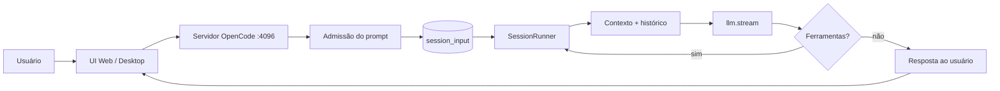
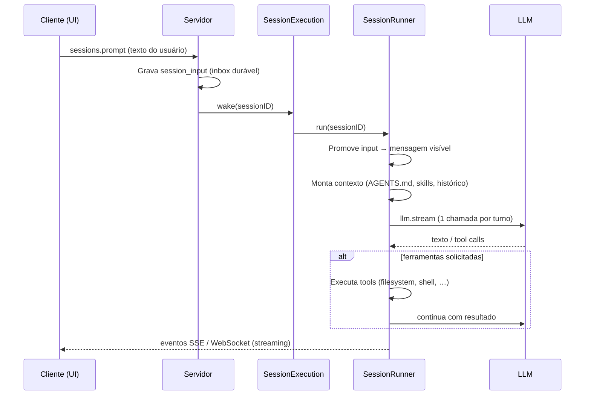

# Documentação XOCP

**eXtensible Open Code Platform** — agente de código com mapeamento
estrutural de projeto (Graphify), telemetria de sessão e continuidade de
trabalho entre sessões (handoff durável).

> Fork independente do [OpenCode](https://github.com/anomalyco/opencode)
> (MIT). Repositório: [github.com/ortizpedroso/xocp](https://github.com/ortizpedroso/xocp).

_Última atualização: Arquitetura de Contratos Aninhados implementada._

---

## O que o XOCP faz

O XOCP é um **agente de programação** que:

1. Recebe prompts do usuário (texto, comandos `/`, contexto `@`)
2. Mantém **sessões duráveis** com histórico, ferramentas e permissões
3. Chama modelos de linguagem (LLM) com contexto do projeto
4. Executa **ferramentas** no ambiente local (arquivos, shell, busca,
   tarefas em background, incluindo subagentes paralelos via `task`)
5. Devolve respostas em streaming até concluir o turno ou pedir aprovação

Além da base herdada do OpenCode, o XOCP adiciona capacidades próprias
já em funcionamento, incluindo a **Arquitetura de Contratos Aninhados**:

| # | Recurso | O que faz | Status |
|---|---------|-----------|--------|
| 1 | Telemetria de sessão | Observa cada sessão (turnos, ferramentas usadas, duração) e calcula um score de complexidade | **Ativo** |
| 2/3 | Mapeamento estrutural (Graphify) | Sob demanda (opt-in), mapeia a estrutura do código em um grafo — chamadas, imports, herança — sem custo de LLM. Sugestão aparece quando a sessão fica complexa o suficiente | **Ativo** |
| 4 | Handoff durável | O agente pode gravar um resumo (até 2000 caracteres) ao fim de um trabalho, pra outra sessão retomar depois sem reconstruir contexto do zero | **Ativo** |
| 5 | Templates Multi-Camada | Briefs e Executors com contrato bidirecional por cluster (backend/frontend/core/integration) | **Ativo** |
| 6 | Avaliador Dual-Lens | Análise independente em duas lentes (Evidência + Impacto) com 3 Travas cognitivas | **Ativo** |
| 7 | State Snapshot | Persistência de estado para continuidade entre ciclos e escalações | **Ativo** |
| 8 | Classificação L1/L2/L3 | Intervenção humana escalonada por severidade objetiva | **Ativo** |
| 9 | Meta-Governança | Auto-compliance: XOCP segue suas próprias regras de mudança | **Ativo** |
| 10 | Auditabilidade Seletiva | Artefatos de governança versionados, runtime regenerável gitignored | **Parcial** |

---

## Agentes Cognitivos XOCP

O XOCP possui **13 agentes especializados**:

### Agentes Principais
- **analista**: Planejamento estratégico e decomposição de tarefas
- **avaliador**: Validação dual-lens (Evidência + Impacto) com 3 Travas
- **elicitador**: Elicitação de requisitos e clarificação de contexto

### Leads por Cluster
- **backend-lead**: APIs, banco de dados, segurança, performance
- **frontend-lead**: UI, acessibilidade, design tokens, UX
- **core-lead**: Primitivas, contratos, invariantes do sistema
- **integration-lead**: Testes E2E, cross-boundary, integrações

### Agentes de Governança
- **baseline-auditor**: Auditoria de baseline e padrões
- **pattern-auditor**: Detecção de padrões e anti-padrões
- **workflow-executor**: Execução de workflows definidos
- **workflow-triador**: Triagem e roteamento de workflows
- **evolution-incident-reporter**: Report de incidentes e evolução
- **research-operator**: Pesquisa e síntese de informação

---

## Arquitetura de Contratos Aninhados

### Níveis de Validação

```
┌─────────────────────────────────────────────────────────┐
│ NÍVEL 5: META-GOVERNANÇA                                │
│ "O XOCP segue suas próprias regras?"                    │
├─────────────────────────────────────────────────────────┤
│ NÍVEL 4: AUDITORIA EXTERNA                              │
│ "Uma IA independente valida as mudanças?"               │
├─────────────────────────────────────────────────────────┤
│ NÍVEL 3: CONTRATO BIDIRECIONAL                          │
│ "Brief ↔ Executor ↔ Avaliador estão alinhados?"         │
├─────────────────────────────────────────────────────────┤
│ NÍVEL 2: INDEPENDÊNCIA COGNITIVA                        │
│ "Avaliador forma opinião antes do confronto?"           │
├─────────────────────────────────────────────────────────┤
│ NÍVEL 1: CONTINUIDADE DE CONTEXTO                       │
│ "Estado persiste entre ciclos e escalações?"            │
└─────────────────────────────────────────────────────────┘
```

### Templates Multi-Camada

Cada cluster possui templates específicos com 3 camadas:

**Camada 1: Contrato Global**
- Objetivo claro e mensurável
- Critérios numerados com IDs únicos (`criteria.id`)
- Definição de Pronto (DoD)
- Testes obrigatórios

**Camada 2: Contrato do Cluster**
- Especificidades backend/frontend/core/integration
- Padrões arquiteturais do domínio
- Restrições técnicas específicas

**Camada 3: Especificidades do Sistema**
- Contexto dinâmico
- Hipóteses assumidas
- Riscos identificados

**Regra Crítica:** `criteria.id` do Brief DEVE ser espelhado no `criteria_met.id` do Executor.

### Avaliador Dual-Lens (3 Travas)

**TRAVA 1: Validação do Brief (Pré-Avaliação)**
- YAML frontmatter válido
- Template do cluster correto
- Critérios numerados com IDs únicos

**TRAVA 2: Dual-Lens (Análise Independente)**

LENTE 1 — EVIDÊNCIA (O que foi feito está correto?)
1. Leia Brief completo (fonte da verdade)
2. Leia código real (arquivos em files_expected)
3. Execute testes
4. Avalie: critérios, restrições, padrões

LENTE 2 — IMPACTO (Quais as consequências?)
5. Use grep para buscar usos do código modificado
6. Avalie: regressões, segurança, acessibilidade, contratos

**NUNCA leia o resumo do Executor ainda.**

**TRAVA 3: Confronto com Resumo (Pós-Análise)**
7. AGORA leia execution_summary_read
8. Compare: Executor DIZ vs VOCÊ encontrou
9. Verifique criteria.id 1:1
10. Emite veredito com diagnóstico de AMBAS as lentes

### State Snapshot

Persistência atômica de estado por ciclo:
- Ciclo atual e timestamp
- Git hash do estado do código
- Agente responsável
- Tarefa em execução
- Histórico de decisões
- Erros encontrados
- Hipóteses ativas
- Contexto relevante

Permite retomada após interrupções ou escalações humanas.

### Classificação L1/L2/L3

**L1_LOCAL_ADJUST**: Executor retoma com contexto local
- Gatilho: ≤2 critérios falhando
- Ação: Ajuste local sem mudar Brief

**L2_REPLANNING**: Analista ajusta Briefs afetados
- Gatilho: 3-5 critérios OU 1 contrato quebrado
- Ação: Replanejamento parcial

**L3_REDIRECTION**: Analista re-mapeia abordagem completa
- Gatilho: >5 critérios OU hipótese fundamental refutada
- Ação: Redirecionamento estratégico

---

## Stack tecnológica

| Camada | Tecnologia |
|--------|------------|
| Runtime | [Bun](https://bun.sh) |
| Core / API | TypeScript, [Effect](https://effect.website), SessionV2 |
| Servidor HTTP | Hono (via Effect HTTP) |
| Banco local | SQLite (Drizzle ORM) |
| UI web / desktop | SolidJS, Vite, Tailwind |
| LLM | Provedores via `@opencode-ai/llm` (OpenAI, Anthropic, etc.) |
| Graphify | CLI externa (`graphifyy`, versão travada), invocada localmente — sem servidor, sem sidecar |

Pacotes principais do monorepo:

- `packages/opencode` — servidor e CLI
- `packages/app` — interface web compartilhada
- `packages/core` — sessão, ferramentas, permissões, governança
- `packages/llm` — streaming com provedores

---

## Fluxo: da entrada à resposta

### Visão geral



### Detalhe do turno (SessionV2)



### Modos de entrega do prompt

| Modo | Comportamento |
|------|----------------|
| **steer** (padrão) | Entra na fila e é promovido no próximo limite seguro do turno |
| **queue** | Aguarda a sessão ficar ociosa antes de ser promovido |

Interrupção (`sessions.interrupt`) cancela o trabalho **neste processo**; o inbox durável é preservado para retomada.

---

## Como desenvolver localmente

```bash
bun install
bun dev web          # tudo em http://localhost:4096
# ou
bun dev:local        # UI :4444 + API :4096
```

A UI precisa do servidor API na porta **4096**. Só `bun dev:web` (frontend) deixa os controles desabilitados.

Detalhes: `specs/xocp/workflow.md` e `README.md`.

---

## Governança e Auditabilidade

### Artefatos Versionados
- `specs/xocp/templates/` — Templates de Brief e Executor
- `.opencode/briefs/` — Briefs de mudanças (quando aplicável)
- `.opencode/reviews/` — Reviews de avaliação
- `.opencode/evolution/` — Histórico evolutivo

### Artefatos Runtime (não versionados)
- `.opencode/state/` — Snapshots de estado (regeneráveis)
- `.opencode/execution-log/` — Logs de execução
- `.opencode/dag.db*` — Banco de dados do grafo

### Meta-Governança (Implementado — Fase C)
- `packages/core/src/governance/internal-change-detector.ts` — detecta mudanças em arquivos internos do XOCP
- `packages/core/src/governance/governance-validator.ts` — valida artefatos obrigatórios (Brief de governança)
- `packages/core/src/governance/governance-reporter.ts` — gera relatório de compliance
- `scripts/pre-commit-governance.ts` — hook de pre-commit com bloqueio de mudanças internas sem Brief
- Skip auditável via `XOCP_SKIP_GOVERNANCE=1` com registro persistente em `.opencode/governance-skips.log`; skip é **bloqueado** em arquivos críticos (`packages/core/`, `packages/opencode/`, `AGENTS.md`, `specs/xocp/`)
- `scripts/cleanup-runtime-artifacts.sh` — limpeza apenas de artefatos de runtime
- **Hook ATIVADO**: `.husky/pre-commit` executa `bun scripts/pre-commit-governance.ts` em todo commit (fallback seguro se bun ausente do PATH)
- Scripts npm utilitários: `bun run governance:check` e `bun run governance:cleanup`
- Cobertura de briefs validada por parse real da seção "Arquivos Afetados" (`extractCoveredFiles`)
- Brief de ativação versionado para auditoria: `.opencode/briefs/2026-09-24-fase-c-ativacao-governanca.md`

## Consistência V1/V2 (Fase B)
- Prompts canônicos vivem em `packages/opencode/src/agent/prompt/*.txt` (V1) e são espelhados em `packages/core/src/plugin/*.txt` (V2)
- Paridade garantida por hash MD5 idêntico nos 11 prompts ativos
- Teste automático: `test/prompts-mirror.test.ts` (valida hash arquivo a arquivo e contagem V1 == V2)

---

## Como este documento é atualizado

1. **Fonte:** `specs/xocp/documentacao.md` (este arquivo)
2. **Geração:** `bun run generate:xocp-docs` → `packages/app/src/generated/documentacao.ts`
3. **CI:** o workflow `xocp-ci` falha se a spec mudou sem regenerar
4. **Regra para agentes:** ao alterar fluxo de sessão, stack ou roadmap XOCP, atualize este arquivo e rode o script acima

---

## Referências internas

- `specs/v2/session.md` — especificação SessionV2
- `AGENTS.md` — regras de desenvolvimento XOCP
- `specs/xocp/workflow.md` — fluxo local vs Cloud Agent
- `specs/xocp/archive/architecture.md` — arquitetura técnica histórica
- `specs/xocp/templates/` — templates multi-camada por cluster
- `packages/core/src/state/snapshot.ts` — módulo State Snapshot
- `packages/core/src/escalation/classification.ts` — classificação L1/L2/L3
