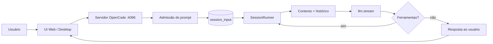
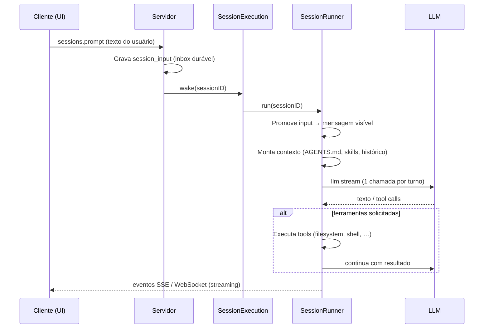

# Documentação XOCP

**eXtensible Open Code Platform** — plataforma de agente de código com mapeamento estrutural (Graphify), orquestração por clusters e handoff durável entre agentes.

> Fork independente do [OpenCode](https://github.com/anomalyco/opencode) (MIT). Repositório: [github.com/ortizpedroso/xocp](https://github.com/ortizpedroso/xocp).

_Última atualização: gerada a partir de `specs/xocp/documentacao.md`._

---

## O que a IA faz

O XOCP é um **agente de programação** que:

1. Recebe prompts do usuário (texto, comandos `/`, contexto `@`)
2. Mantém **sessões duráveis** com histórico, ferramentas e permissões
3. Chama modelos de linguagem (LLM) com contexto do projeto
4. Executa **ferramentas** no ambiente local (arquivos, shell, busca, tarefas em background)
5. Devolve respostas em streaming até concluir o turno ou pedir aprovação

Recursos planejados no roadmap XOCP (em ordem):

| # | Recurso | Status |
|---|---------|--------|
| 1 | Telemetria de sessão + score | Planejado |
| 2 | Graphify (mapa estrutural do código) | Planejado |
| 3 | UI de mapa (opt-in) | Planejado |
| 4 | Handoff durável (≤2000 chars) | Planejado |
| 5 | Clusters FE / BE / Core | Planejado |
| 6 | Prefetch de mapa | Planejado |

---

## Stack tecnológica

| Camada | Tecnologia |
|--------|------------|
| Runtime | [Bun](https://bun.sh) |
| Core / API | TypeScript, [Effect](https://effect.website), SessionV2 |
| Servidor HTTP | Hono (via Effect HTTP) |
| Banco local | SQLite (Drizzle ORM) |
| UI web / desktop | SolidJS, Vite, Tailwind |
| LLM | Provedores via `@opencode-ai/llm` (OpenAI, Anthropic, etc.) |
| Graphify (futuro) | Sidecar Python + FastAPI + `graphifyy` |

Pacotes principais do monorepo:

- `packages/opencode` — servidor e CLI
- `packages/app` — interface web compartilhada
- `packages/core` — sessão, ferramentas, permissões
- `packages/llm` — streaming com provedores

---

## Fluxo: da entrada à resposta

### Visão geral



### Detalhe do turno (SessionV2)



### Modos de entrega do prompt

| Modo | Comportamento |
|------|----------------|
| **steer** (padrão) | Entra na fila e é promovido no próximo limite seguro do turno |
| **queue** | Aguarda a sessão ficar ociosa antes de ser promovido |

Interrupção (`sessions.interrupt`) cancela o trabalho **neste processo**; o inbox durável é preservado para retomada.

---

## Como desenvolver localmente

```bash
bun install
bun dev web          # tudo em http://localhost:4096
# ou
bun dev:local        # UI :4444 + API :4096
```

A UI precisa do servidor API na porta **4096**. Só `bun dev:web` (frontend) deixa os controles desabilitados.

Detalhes: `specs/xocp/workflow.md` e `README.md`.

---

## Como este documento é atualizado

1. **Fonte:** `specs/xocp/documentacao.md` (este arquivo)
2. **Geração:** `bun run generate:xocp-docs` → `packages/app/src/generated/documentacao.ts`
3. **CI:** o workflow `xocp-ci` falha se a spec mudou sem regenerar
4. **Regra para agentes:** ao alterar fluxo de sessão, stack ou roadmap XOCP, atualize este arquivo e rode o script acima

---

## Referências internas

- `specs/v2/session.md` — especificação SessionV2
- `AGENTS.md` — regras de desenvolvimento XOCP
- `specs/xocp/workflow.md` — fluxo local vs Cloud Agent
